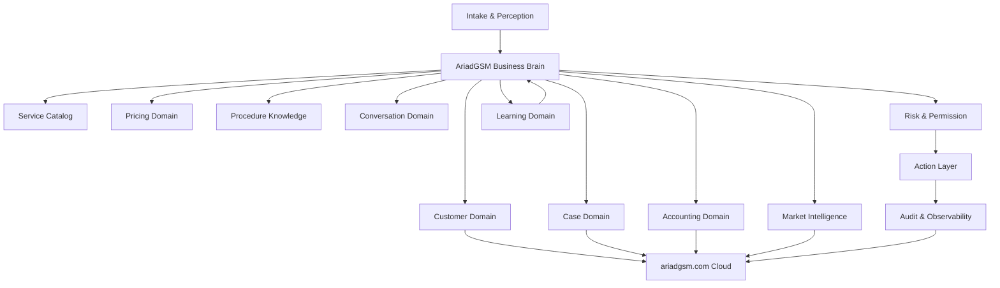

# AriadGSM Business Domain Map

Mapa maestro de dominios para construir AriadGSM como IA operativa de negocio, no como bot potente.

Fecha: 2026-04-27
Estado: base de arquitectura de negocio para validacion
Relacion:

- `ARIADGSM_BUSINESS_OPERATING_MODEL.md`
- `ARIADGSM_AUTONOMOUS_OPERATING_SYSTEM_1.0.md`
- `ARIADGSM_RESEARCH_AND_DECISION_PROTOCOL.md`

## 1. Principio central

AriadGSM no se debe disenar desde la pantalla ni desde el mouse.

Se debe disenar desde el negocio.

```text
Negocio -> Dominios -> Casos -> Decisiones -> Herramientas -> Acciones -> Verificacion -> Aprendizaje
```

La IA es el cerebro operativo. Las herramientas, mouse, teclado, navegadores, OCR, accesibilidad y paneles son cuerpo operativo. El cuerpo no decide el negocio; ejecuta decisiones autorizadas por el cerebro y verificadas por el supervisor.

## 2. Investigacion externa usada

Este mapa se basa en fuentes externas confiables y en lo que ya capturo AriadGSM localmente.

### 2.1 Agentes de IA

OpenAI define un agente con tres bases: modelo para razonamiento, herramientas para actuar e instrucciones/guardrails para comportamiento. Tambien recomienda patrones con un agente gerente que coordina especialistas por dominio cuando el flujo crece.

Impacto en AriadGSM:

- AriadGSM debe tener un Business Brain gerente.
- Las areas como contabilidad, precios, mercado, procesos y conversacion deben ser especialistas.
- Las herramientas no son la IA; son capacidades invocadas por la IA.

Referencia:

- https://openai.com/business/guides-and-resources/a-practical-guide-to-building-ai-agents/
- https://developers.openai.com/api/docs/guides/agents

### 2.2 Herramientas y guardrails

OpenAI Agents SDK describe guardrails de entrada, salida y herramientas. Las acciones con efectos secundarios deben validarse antes y despues de ejecutarse.

Impacto en AriadGSM:

- Enviar mensaje, confirmar pago, mover mouse, registrar contabilidad final o ejecutar herramienta tecnica son acciones con riesgo.
- Cada accion necesita permiso, validacion y auditoria.
- El cerebro decide, pero el supervisor puede bloquear.

Referencia:

- https://openai.github.io/openai-agents-python/guardrails/

### 2.3 Domain-Driven Design

Microsoft recomienda modelar sistemas complejos por dominios/bounded contexts, con lenguaje comun, entidades, agregados y responsabilidades claras. La capa de dominio debe expresar el negocio y no depender de detalles tecnicos.

Impacto en AriadGSM:

- No mezclar WhatsApp, contabilidad, precios, clientes y herramientas en un solo modulo.
- Cada dominio debe tener responsabilidad clara.
- El negocio debe vivir en dominio/memoria/politicas, no en scripts de pantalla.

Referencias:

- https://learn.microsoft.com/en-us/dotnet/architecture/microservices/microservice-ddd-cqrs-patterns/ddd-oriented-microservice
- https://learn.microsoft.com/en-us/azure/architecture/microservices/model/domain-analysis

### 2.4 Riesgo de IA

NIST AI RMF recomienda gestionar riesgos de IA desde diseno, desarrollo, uso y evaluacion.

Impacto en AriadGSM:

- La autonomia debe ser por niveles.
- Acciones sensibles deben tener evaluacion de riesgo.
- Debe existir auditoria de lo que vio, penso, decidio, hizo y aprendio.

Referencia:

- https://www.nist.gov/itl/ai-risk-management-framework

### 2.5 Seguridad LLM

OWASP LLM Top 10 identifica riesgos como prompt injection, data poisoning, excessive agency, filtracion de datos y confianza excesiva.

Impacto en AriadGSM:

- Un cliente o proveedor no debe poder darle instrucciones al cerebro para saltarse reglas.
- La IA no debe tener permisos ilimitados.
- El aprendizaje desde chats debe ser validado antes de convertirse en conocimiento.

Referencia:

- https://owasp.org/www-project-top-10-for-large-language-model-applications/

### 2.6 Lectura de interfaces

Microsoft UI Automation expone patrones de controles, texto, scroll, ventanas, seleccion e invocacion. Es una fuente mas estructurada que OCR cuando la aplicacion la soporta.

Impacto en AriadGSM:

- OCR debe ser respaldo, no verdad principal.
- El Reader Core debe preferir fuentes estructuradas: DOM, UI Automation, accesibilidad, eventos.
- La accion debe trabajar sobre elementos verificados, no coordenadas ciegas.

Referencias:

- https://learn.microsoft.com/en-us/windows/win32/winauto/uiauto-controlpatternsoverview
- https://learn.microsoft.com/en-us/dotnet/framework/ui-automation/ui-automation-events-overview

### 2.7 Contabilidad con evidencia

La guia de registros de negocio del IRS indica que un sistema de registros debe mostrar ingresos y gastos, identificar fuente de recibos, guardar soporte, usar diarios/libros y reconciliar cuentas.

Impacto en AriadGSM:

- La IA puede detectar pagos, pero no debe cerrar contabilidad sin evidencia.
- Cada pago debe ligarse a cliente, caso, moneda, metodo, fecha, fuente y soporte.
- Deben existir borradores contables, diarios, cierres y conciliacion.

Referencia:

- https://www.irs.gov/publications/p583

## 3. Decision de arquitectura

Alternativas evaluadas:

### Alternativa A: bot grande con reglas

```text
Si ve precio -> responder.
Si ve pago -> registrar.
Si falla herramienta -> probar otra.
```

Rechazada.

Motivo: AriadGSM cambia por pais, cliente, proveedor, herramienta, pago, deuda, bloqueo, demanda y riesgo. Esto produciria parches infinitos.

### Alternativa B: un solo cerebro gigante

Un solo agente decide todo directamente.

Rechazada como arquitectura final, aunque puede servir para prototipo.

Motivo: mezcla contabilidad, ventas, herramientas, memoria, mercado y seguridad en un solo lugar. Dificil de auditar y corregir.

### Alternativa C: Business Brain gerente con dominios especialistas

El cerebro central entiende el objetivo y coordina dominios especializados.

Seleccionada.

Motivo: coincide con patrones de agentes, DDD y riesgo. Permite que la IA sea una sola operadora para Bryams, pero internamente tenga areas claras.

```text
Business Brain
  -> Customer Domain
  -> Case Domain
  -> Service Domain
  -> Pricing Domain
  -> Accounting Domain
  -> Market Domain
  -> Procedure Domain
  -> Conversation Domain
  -> Action Domain
  -> Risk/Supervisor Domain
  -> Learning Domain
```

## 4. Mapa general



## 5. Lenguaje comun

Estas palabras deben tener significado fijo en AriadGSM:

```text
Cliente        = persona o negocio que solicita servicio.
Proveedor      = persona, panel, servidor o grupo que ofrece capacidad/costo.
Caso           = trabajo concreto que debe resolverse.
Servicio       = tipo de solucion vendida: FRP, Unlock, MDM, F4, etc.
Procedimiento  = pasos para resolver un servicio bajo condiciones especificas.
Herramienta    = programa, panel, cuenta, licencia, credito o acceso usado para ejecutar.
Pago           = entrada de dinero asociada a cliente/caso.
Deuda          = monto pendiente asociado a cliente/caso.
Reembolso      = devolucion o credito a favor.
Oferta         = senal de mercado/proveedor con precio, servicio y disponibilidad.
Evidencia      = comprobante, captura, mensaje, transaccion o archivo que soporta una decision.
Accion         = cambio en el mundo: mensaje enviado, click, registro, herramienta usada.
Aprendizaje    = conocimiento aprobado o pendiente de aprobar.
```

## 6. Dominio: Intake & Perception

Responsabilidad:

Leer senales del mundo sin decidir el negocio.

Fuentes:

- WhatsApp Web en Edge, Chrome y Firefox.
- Panel local.
- ariadgsm.com.
- Herramientas GSM.
- Capturas visuales.
- UI Automation/accesibilidad.
- OCR como respaldo.
- Archivos, comprobantes o imagenes permitidas.

No debe hacer:

- Cerrar navegadores.
- Responder clientes.
- Registrar contabilidad final.
- Aprender como verdad sin validacion.

Entidades:

```text
RawObservation
ScreenRegion
WindowIdentity
ReaderSource
MessageCandidate
EvidenceCandidate
ConfidenceScore
```

Salida esperada:

```text
observed_text
source
channel
window
confidence
evidence_level
timestamp
```

Prueba de aceptacion:

- Detecta wa-1, wa-2 y wa-3 sin cerrar ventanas.
- Marca ruido como ruido.
- Diferencia texto de cliente vs texto de interfaz cuando la fuente lo permite.

## 7. Dominio: Customer

Responsabilidad:

Entender quien es cada cliente y como debe tratarse.

Datos:

- nombre
- alias
- pais
- idioma
- jerga
- WhatsApp origen
- historial de casos
- pagos
- deudas
- confianza
- reclamos
- frecuencia
- prioridad
- estilo de respuesta

Decisiones:

- Es cliente, proveedor, grupo, tecnico interno o ruido?
- Es recurrente?
- Tiene deuda?
- Tiene pago pendiente de validar?
- Merece prioridad?
- Que tono usar?

Entidades:

```text
CustomerProfile
CustomerAlias
CustomerTrustScore
CustomerLedgerSummary
CustomerPreference
CustomerRiskFlag
```

Reglas:

- Un numero/chat no siempre equivale a un cliente.
- Un cliente puede aparecer en varios WhatsApp.
- Un nombre de grupo no debe mezclarse con cliente final.

Prueba de aceptacion:

- Une conversaciones del mismo cliente cuando hay evidencia.
- No une clientes solo por nombre parecido.
- Muestra por que cree que dos identidades son la misma.

## 8. Dominio: Case Manager

Responsabilidad:

Convertir mensajes sueltos en trabajos reales.

Un caso debe existir cuando hay:

- solicitud de servicio
- cotizacion
- pago
- deuda
- procedimiento en curso
- reclamo
- resultado pendiente

Estados:

```text
NEW_REQUEST
NEEDS_INFO
QUOTED
WAITING_PAYMENT
PAID_PENDING_WORK
IN_PROGRESS
WAITING_PROVIDER
WAITING_CLIENT
DONE_PENDING_DELIVERY
DELIVERED
ACCOUNTING_PENDING
CLOSED
FAILED
REFUNDED
HUMAN_REVIEW
```

Entidades:

```text
Case
CaseEvent
CaseStatus
CaseEvidence
CaseAssignment
CaseOutcome
```

Decisiones:

- Crear caso nuevo o actualizar uno existente?
- Que informacion falta?
- Que estado tiene?
- Que proxima accion corresponde?
- Hay bloqueo por pago, herramienta, cliente o proveedor?

Prueba de aceptacion:

- Un chat con "precio + modelo + pago" termina en un caso completo.
- Un pago sin servicio queda como borrador pendiente de asociacion.
- Un caso no se cierra sin resultado y contabilidad.

## 9. Dominio: Service Catalog

Responsabilidad:

Mantener la lista viva de servicios AriadGSM.

Servicios iniciales:

```text
Samsung F4
Samsung Unlock
Samsung FRP
Samsung MDM
Samsung KG / Knox
Samsung senal / Claro
Xiaomi FRP
Xiaomi Reset + FRP
Xiaomi Mi Account
Xiaomi HyperOS / MIUI
Motorola FRP
Motorola Unlock
Honor / Huawei FRP
Tecno / Infinix FRP
iPhone / iCloud
Creditos
Licencias
Alquiler de herramientas
Firmware / Flash / ROM
Bootloader / BROM / Root
IMEI / servidor
```

Cada servicio debe tener:

- nombre comercial
- variantes
- marcas/modelos
- datos requeridos
- herramientas posibles
- proveedor posible
- costo base
- margen
- riesgo
- tiempo estimado
- evidencia requerida
- permisos de autonomia

Prueba de aceptacion:

- La IA no cotiza un servicio si faltan datos obligatorios.
- La IA distingue servicio parecido pero no igual.
- Un nuevo servicio puede agregarse sin tocar el codigo central.

## 10. Dominio: Pricing

Responsabilidad:

Calcular precios con razon comercial.

Variables:

- costo proveedor
- margen minimo
- margen fijo
- moneda
- pais
- demanda
- disponibilidad
- riesgo tecnico
- urgencia
- historial del cliente
- tasa de exito
- competencia/ofertas
- costo de herramienta/licencia/credito

Entidades:

```text
PriceQuote
CostBasis
MarginPolicy
CurrencyRate
PriceHistory
PriceDecision
```

Decisiones:

- Cotizar ahora o pedir datos?
- Precio recomendado?
- Precio minimo?
- Precio con riesgo?
- Moneda correcta?
- Se necesita permiso humano?

Reglas:

- No prometer precio si el servicio depende de proveedor inestable.
- No usar ofertas de grupo sin validar proveedor.
- Cotizacion debe quedar ligada a caso.

Prueba de aceptacion:

- Para un servicio Xiaomi con costo detectado, genera precio recomendado y razon.
- Si falta modelo, pide modelo antes de cotizar.
- Si la oferta es dudosa, la manda a revision.

## 11. Dominio: Accounting

Responsabilidad:

Convertir conversaciones, comprobantes y pagos en contabilidad verificable.

Subdominios:

```text
Cash In
Cash Out
Debt
Refund
Provider Expense
Credits/Licenses
Profit
Daily Close
Reconciliation
```

Entidades:

```text
Payment
Debt
Refund
ReceiptEvidence
ProviderExpense
LedgerEntry
AccountingDraft
DailyCashClose
ReconciliationItem
```

Datos obligatorios para cerrar un movimiento:

- cliente o proveedor
- caso
- monto
- moneda
- metodo
- fecha/hora
- fuente
- evidencia
- estado de validacion

Estados:

```text
DETECTED
DRAFT
NEEDS_EVIDENCE
NEEDS_CASE
NEEDS_HUMAN_REVIEW
CONFIRMED
RECONCILED
REJECTED
VOIDED
```

Reglas:

- Un monto detectado no es pago confirmado.
- Un comprobante sin caso no cierra contabilidad.
- Un reembolso requiere relacion con pago/caso original.
- Grupos de pagos no son cliente final por defecto.
- Toda contabilidad final debe tener evidencia.

Prueba de aceptacion:

- Detecta "Yape 55 soles" como borrador, no como cierre final.
- Liga pago a caso cuando hay evidencia suficiente.
- Muestra caja diaria: entradas, salidas, deudas, reembolsos, utilidad estimada.

## 12. Dominio: Market Intelligence

Responsabilidad:

Entender mercado, proveedores, demanda y oportunidades.

Fuentes:

- grupos
- proveedores
- chats
- listas de precios
- mensajes en ingles/espanol
- ofertas
- reportes de exito/fallo

Entidades:

```text
Provider
Offer
MarketSignal
AvailabilitySignal
DemandSignal
ProviderReliability
PriceMovement
```

Decisiones:

- Que proveedor conviene?
- Que servicio esta ON/OFF?
- Que precio subio o bajo?
- Que demanda se repite?
- Que oferta es confiable?
- Que oferta debe ignorarse?

Prueba de aceptacion:

- Detecta una oferta como senal de mercado, no como solicitud de cliente.
- Actualiza costo sugerido sin cambiar precio final automaticamente.
- Muestra proveedores confiables por servicio.

## 13. Dominio: Procedure Knowledge

Responsabilidad:

Guardar como se resuelven trabajos y como se recupera de fallos.

Fuentes:

- conversaciones
- videos
- notas del operador
- resultados de herramientas
- errores
- correcciones humanas
- proveedores

Entidades:

```text
Procedure
ProcedureStep
ToolRequirement
FailureMode
RecoveryPlan
HumanNote
SuccessEvidence
```

Reglas:

- Un procedimiento aprendido de chat/video queda como borrador hasta validar.
- Cada procedimiento debe tener condiciones de uso.
- Cada paso debe tener evidencia o fuente.
- Si cambia una herramienta, se actualiza Tool Registry, no el cerebro entero.

Prueba de aceptacion:

- La IA puede decir: "para este caso he visto 2 procedimientos posibles".
- Si USB Redirector falla, propone recuperacion o alternativa documentada.
- No ejecuta procedimiento riesgoso sin permiso.

## 14. Dominio: Tool & License Inventory

Responsabilidad:

Controlar herramientas, cuentas, licencias, creditos y accesos disponibles.

Entidades:

```text
Tool
ToolAccount
License
CreditBalance
ServerPanel
DriverPackage
Capability
ToolRisk
ToolStatus
```

Datos por herramienta:

- nombre
- version
- ubicacion
- cuenta/licencia
- creditos
- servicios soportados
- riesgos
- permisos
- verificacion de exito
- errores conocidos
- alternativas

Regla:

La IA no debe "saber de memoria" que herramienta usar. Debe consultar capacidades registradas y memoria de casos.

Prueba de aceptacion:

- Muestra que herramientas sirven para un servicio.
- Detecta licencia/credito insuficiente.
- Propone alternativa si una herramienta esta caida.

## 15. Dominio: Conversation

Responsabilidad:

Responder, negociar y pedir datos con estilo AriadGSM.

Tipos de respuesta:

- pedir modelo
- pedir IMEI
- pedir pais/operador
- cotizar
- confirmar pago recibido como pendiente
- avisar proceso en curso
- pedir comprobante
- explicar fallo
- ofrecer alternativa
- negociar
- cerrar entrega

Entidades:

```text
DraftReply
ToneProfile
LanguageProfile
NegotiationContext
ResponseRisk
CustomerMessagePlan
```

Reglas:

- La IA debe sonar como AriadGSM, no como robot.
- Debe adaptar jerga por pais.
- No debe prometer resultado sin validacion tecnica.
- No debe enviar informacion sensible a grupos.
- En autonomia baja, crea borrador para Bryams.

Prueba de aceptacion:

- Redacta respuesta corta, natural y con datos faltantes.
- Explica por que no puede cotizar todavia.
- Diferencia cliente directo vs proveedor.

## 16. Dominio: Risk, Permission & Governance

Responsabilidad:

Decidir que puede hacer la IA sola y que requiere Bryams.

Niveles:

```text
L0 Observe
L1 Understand
L2 Draft
L3 Safe Action
L4 Supervised Operation
L5 Broad Autonomy
```

Acciones que requieren mas cuidado:

- enviar mensaje a cliente
- confirmar pago
- crear deuda final
- hacer reembolso
- ejecutar herramienta tecnica
- usar cuenta/licencia
- compartir datos sensibles
- cerrar caso
- publicar precio especial

Entidades:

```text
RiskPolicy
PermissionGrant
HumanApproval
BlockedAction
AutonomyLevel
Tripwire
```

Reglas:

- El prompt del cliente nunca puede subir permisos.
- El chat no puede ordenar a la IA ignorar reglas.
- La IA no puede saltarse supervisor.
- Permisos deben estar fuera del texto aprendido.

Prueba de aceptacion:

- Bloquea una accion financiera sin evidencia.
- Pide permiso para enviar respuesta sensible.
- Explica por que bloqueo.

## 17. Dominio: Action Layer

Responsabilidad:

Ejecutar acciones fisicas o digitales ordenadas por la IA.

No se llamara "automatizacion" como base. Es capa de accion.

Capacidades:

- mouse
- teclado
- abrir chat
- traer ventana
- leer estado de herramienta
- pegar texto
- abrir panel
- capturar evidencia
- ejecutar comando permitido

Entidades:

```text
ActionRequest
ActionPlan
ActionResult
ActionEvidence
InputLock
UserInterruption
VerificationResult
```

Reglas:

- No decide negocio.
- No cierra navegadores salvo orden explicita y segura.
- Debe ceder control si Bryams usa mouse/teclado.
- Debe verificar resultado despues de actuar.
- Debe reportar fallo con causa.

Prueba de aceptacion:

- Abre chat correcto y confirma con lectura.
- Si Bryams mueve mouse, pausa accion fina sin detener toda la IA.
- No toca fuera de cabina autorizada.

## 18. Dominio: Learning

Responsabilidad:

Convertir experiencia en conocimiento corregible.

Tipos de aprendizaje:

```text
Fact
CustomerPattern
ProviderPattern
PricePattern
Procedure
FailureMode
RecoveryPlan
AccountingRule
ConversationStyle
RiskRule
```

Estados:

```text
OBSERVED
CANDIDATE
NEEDS_REVIEW
APPROVED
REJECTED
SUPERSEDED
```

Reglas:

- Aprender no es guardar todo.
- Un dato de OCR dudoso no se vuelve verdad.
- Correccion humana tiene prioridad.
- Aprendizaje debe decir fuente, confianza y vigencia.

Prueba de aceptacion:

- Muestra "aprendi esto" y permite corregir.
- Si Bryams corrige, no repite el mismo error.
- Un aprendizaje viejo puede ser reemplazado.

## 19. Dominio: Cloud / ariadgsm.com

Responsabilidad:

Ser panel de control, respaldo, reportes y sincronizacion.

Debe mostrar:

- clientes
- casos
- pagos/deudas
- caja
- proveedores
- ofertas
- precios
- aprendizajes
- auditoria
- actualizaciones
- salud de cabinas
- reportes

Reglas:

- La decision rapida debe poder ocurrir localmente.
- La nube consolida y respalda.
- La nube no debe ser cuello de botella para lectura en vivo.

Prueba de aceptacion:

- Si la nube esta lenta, la PC sigue leyendo y guarda cola.
- Cuando vuelve conexion, sincroniza sin duplicar pagos/casos.

## 20. Dominio: Audit & Observability

Responsabilidad:

Saber que paso, por que paso y como corregirlo.

Entidades:

```text
AuditEvent
DecisionTrace
ToolTrace
ErrorReport
HealthMetric
EvalResult
OperatorTimeline
```

Debe registrar:

- que vio
- fuente
- confianza
- que penso/resumio
- que decision tomo
- que accion pidio
- quien autorizo
- que resultado obtuvo
- que aprendio
- que fallo

Prueba de aceptacion:

- Si se cierra Edge/Chrome, el reporte dice quien lo ordeno o que proceso lo provoco.
- Si una decision fue mala, se puede rastrear a fuente y regla.
- Las pruebas detectan regresiones antes de publicar version.

## 21. Flujo maestro

```text
1. Perception detecta mensaje/oferta/pago/error.
2. Business Brain identifica actor e intencion.
3. Customer Domain confirma identidad.
4. Case Manager crea o actualiza caso.
5. Service Catalog identifica servicio y datos faltantes.
6. Pricing/Market/Accounting/Procedure aportan contexto.
7. Risk Domain decide nivel permitido.
8. Conversation Domain prepara respuesta o Action Layer ejecuta accion.
9. Verification confirma resultado.
10. Learning guarda aprendizaje candidato.
11. Cloud sincroniza y reporta.
```

## 22. Orden recomendado de construccion

No empezar por mouse ni por UI.

Orden serio:

```text
1. Domain Map validado.
2. Case Manager.
3. Accounting Core evidence-first.
4. Customer/Provider Identity.
5. Service Catalog + Tool Inventory.
6. Pricing + Market Intelligence.
7. Conversation Brain.
8. Risk/Permission Matrix.
9. Action Layer con verificacion.
10. Learning Review.
11. ariadgsm.com business cockpit.
12. Evals y observabilidad por version.
```

## 23. Que no se debe hacer

No hacer:

- Parchar cada ventana.
- Agregar filtros infinitos.
- Convertir la IA en una macro.
- Mezclar contabilidad con lectura OCR sin evidencia.
- Permitir que un mensaje de cliente cambie reglas internas.
- Ejecutar herramientas tecnicas sin verificacion.
- Guardar todo como aprendizaje real.
- Depender de la nube para cada decision en vivo.
- Construir UI tecnica que Bryams no pueda entender.

## 24. Prueba maestra de dominio

Un sistema AriadGSM correcto debe poder responder:

```text
Quien escribio?
Es cliente, proveedor, grupo o ruido?
Que quiere?
Tiene caso abierto?
Que servicio pide?
Que datos faltan?
Que precio conviene?
Hay pago, deuda o reembolso?
Que herramienta/proveedor aplica?
Que riesgo hay?
Puedo actuar solo?
Que debo decir?
Que aprendi?
Como lo pruebo?
```

Si no puede responder eso, todavia no es IA operativa de negocio.

## 25. Primera version objetivo

Version objetivo recomendada: `0.7.0-domain-core`

Alcance:

- Case Manager basico.
- Accounting drafts con evidencia.
- Customer/Provider classification.
- Service Catalog inicial.
- Decision trace visible.
- UI menos tecnica basada en negocio.

Fuera de alcance para esa version:

- Autonomia total.
- Envio automatico de mensajes sensibles.
- Ejecucion tecnica completa sin permiso.
- Contabilidad final sin revision.

## 26. Conclusion

La estructura robusta no es:

```text
Bot + automatizaciones + IA para elegir pasos.
```

La estructura robusta es:

```text
IA de negocio + dominios claros + memoria + herramientas subordinadas + riesgo + evidencia + aprendizaje.
```

AriadGSM debe avanzar como una IA que aprende y opera el negocio completo. La capa de accion existe, pero solo como cuerpo. El cerebro es el Business Brain y su mapa de dominios.

