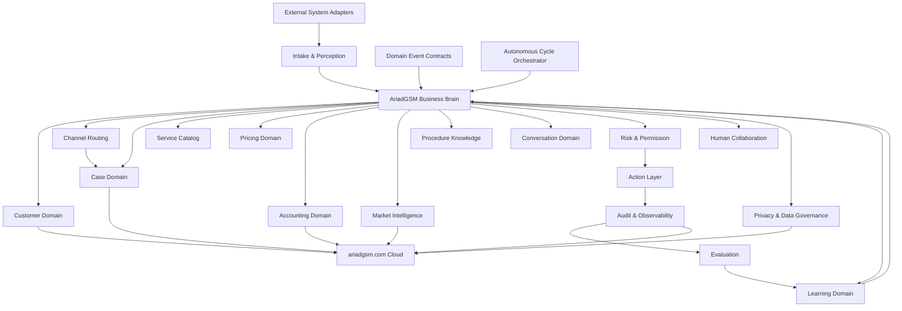

# AriadGSM Business Domain Map

Mapa maestro de dominios para construir AriadGSM como IA operativa de negocio, no como bot potente.

Fecha: 2026-04-27
Estado: base de arquitectura de negocio para validacion
Relacion:

- `ARIADGSM_BUSINESS_OPERATING_MODEL.md`
- `ARIADGSM_AUTONOMOUS_OPERATING_SYSTEM_1.0.md`
- `ARIADGSM_RESEARCH_AND_DECISION_PROTOCOL.md`

## 1. Principio central

AriadGSM no se debe disenar desde la pantalla ni desde el mouse.

Se debe disenar desde el negocio.

```text
Negocio -> Dominios -> Casos -> Decisiones -> Herramientas -> Acciones -> Verificacion -> Aprendizaje
```

La IA es el cerebro operativo. Las herramientas, mouse, teclado, navegadores, OCR, accesibilidad y paneles son cuerpo operativo. El cuerpo no decide el negocio; ejecuta decisiones autorizadas por el cerebro y verificadas por el supervisor.

## 2. Investigacion externa usada

Este mapa se basa en fuentes externas confiables y en lo que ya capturo AriadGSM localmente.

### 2.1 Agentes de IA

OpenAI define un agente con tres bases: modelo para razonamiento, herramientas para actuar e instrucciones/guardrails para comportamiento. Tambien recomienda patrones con un agente gerente que coordina especialistas por dominio cuando el flujo crece.

Impacto en AriadGSM:

- AriadGSM debe tener un Business Brain gerente.
- Las areas como contabilidad, precios, mercado, procesos y conversacion deben ser especialistas.
- Las herramientas no son la IA; son capacidades invocadas por la IA.

Referencia:

- https://openai.com/business/guides-and-resources/a-practical-guide-to-building-ai-agents/
- https://developers.openai.com/api/docs/guides/agents

### 2.2 Herramientas y guardrails

OpenAI Agents SDK describe guardrails de entrada, salida y herramientas. Las acciones con efectos secundarios deben validarse antes y despues de ejecutarse.

Impacto en AriadGSM:

- Enviar mensaje, confirmar pago, mover mouse, registrar contabilidad final o ejecutar herramienta tecnica son acciones con riesgo.
- Cada accion necesita permiso, validacion y auditoria.
- El cerebro decide, pero el supervisor puede bloquear.

Referencia:

- https://openai.github.io/openai-agents-python/guardrails/

### 2.3 Domain-Driven Design

Microsoft recomienda modelar sistemas complejos por dominios/bounded contexts, con lenguaje comun, entidades, agregados y responsabilidades claras. La capa de dominio debe expresar el negocio y no depender de detalles tecnicos.

Impacto en AriadGSM:

- No mezclar WhatsApp, contabilidad, precios, clientes y herramientas en un solo modulo.
- Cada dominio debe tener responsabilidad clara.
- El negocio debe vivir en dominio/memoria/politicas, no en scripts de pantalla.

Referencias:

- https://learn.microsoft.com/en-us/dotnet/architecture/microservices/microservice-ddd-cqrs-patterns/ddd-oriented-microservice
- https://learn.microsoft.com/en-us/azure/architecture/microservices/model/domain-analysis

### 2.4 Riesgo de IA

NIST AI RMF recomienda gestionar riesgos de IA desde diseno, desarrollo, uso y evaluacion.

Impacto en AriadGSM:

- La autonomia debe ser por niveles.
- Acciones sensibles deben tener evaluacion de riesgo.
- Debe existir auditoria de lo que vio, penso, decidio, hizo y aprendio.

Referencia:

- https://www.nist.gov/itl/ai-risk-management-framework

### 2.5 Seguridad LLM

OWASP LLM Top 10 identifica riesgos como prompt injection, data poisoning, excessive agency, filtracion de datos y confianza excesiva.

Impacto en AriadGSM:

- Un cliente o proveedor no debe poder darle instrucciones al cerebro para saltarse guardrails internos.
- La IA no debe tener permisos ilimitados.
- El aprendizaje desde chats debe ser validado antes de convertirse en conocimiento.

Referencia:

- https://owasp.org/www-project-top-10-for-large-language-model-applications/

### 2.6 Lectura de interfaces

Microsoft UI Automation expone patrones de controles, texto, scroll, ventanas, seleccion e invocacion. Es una fuente mas estructurada que OCR cuando la aplicacion la soporta.

Impacto en AriadGSM:

- OCR debe ser respaldo, no verdad principal.
- El Reader Core debe preferir fuentes estructuradas: DOM, UI Automation, accesibilidad, eventos.
- La accion debe trabajar sobre elementos verificados, no coordenadas ciegas.

Referencias:

- https://learn.microsoft.com/en-us/windows/win32/winauto/uiauto-controlpatternsoverview
- https://learn.microsoft.com/en-us/dotnet/framework/ui-automation/ui-automation-events-overview

### 2.7 Contabilidad con evidencia

La guia de registros de negocio del IRS indica que un sistema de registros debe mostrar ingresos y gastos, identificar fuente de recibos, guardar soporte, usar diarios/libros y reconciliar cuentas.

Impacto en AriadGSM:

- La IA puede detectar pagos, pero no debe cerrar contabilidad sin evidencia.
- Cada pago debe ligarse a cliente, caso, moneda, metodo, fecha, fuente y soporte.
- Deben existir borradores contables, diarios, cierres y conciliacion.

Referencia:

- https://www.irs.gov/publications/p583

## 3. Decision de arquitectura

Alternativas evaluadas:

### Alternativa A: bot grande con instrucciones fijas

```text
Si ve precio -> responder.
Si ve pago -> registrar.
Si falla herramienta -> probar otra.
```

Rechazada.

Motivo: AriadGSM cambia por pais, cliente, proveedor, herramienta, pago, deuda, bloqueo, demanda y riesgo. Esto produciria parches infinitos.

### Alternativa B: un solo cerebro gigante

Un solo agente decide todo directamente.

Rechazada como arquitectura final, aunque puede servir para prototipo.

Motivo: mezcla contabilidad, ventas, herramientas, memoria, mercado y seguridad en un solo lugar. Dificil de auditar y corregir.

### Alternativa C: Business Brain gerente con capacidades mentales especializadas

El cerebro central entiende el objetivo y coordina capacidades mentales especializadas. Cada dominio representa una forma de pensar sobre el negocio, no una lista cerrada de instrucciones.

Seleccionada.

Motivo: coincide con patrones de agentes, DDD y riesgo. Permite que la IA sea una sola operadora para Bryams, pero internamente tenga areas claras de razonamiento.

```text
Business Brain
  -> Customer Domain
  -> Channel Routing Domain
  -> Case Domain
  -> Service Domain
  -> Pricing Domain
  -> Accounting Domain
  -> Market Domain
  -> Procedure Domain
  -> Conversation Domain
  -> Action Domain
  -> Risk/Supervisor Domain
  -> Learning Domain
  -> Evaluation Domain
  -> Privacy & Data Governance Domain
  -> Human Collaboration Domain
  -> Domain Event Contracts
  -> External System Adapters
  -> Autonomous Cycle Orchestrator
```

## 4. Mapa general



Criterio de lenguaje:

```text
Dominio = capacidad mental especializada del Business Brain.
Guardrail = limite de seguridad, evidencia o permiso.
Entidad = memoria estructurada que ayuda a pensar.
Accion = ejecucion fisica/digital subordinada al cerebro.
```

Si una seccion empieza a parecer una lista de pasos fijos, debe reescribirse como preguntas de razonamiento, hipotesis, evidencias y explicaciones.

## 5. Lenguaje comun

Estas palabras deben tener significado fijo en AriadGSM:

```text
Cliente        = persona o negocio que solicita servicio.
Proveedor      = persona, panel, servidor o grupo que ofrece capacidad/costo.
Caso           = trabajo concreto que debe resolverse.
Servicio       = tipo de solucion vendida: FRP, Unlock, MDM, F4, etc.
Procedimiento  = pasos para resolver un servicio bajo condiciones especificas.
Herramienta    = programa, panel, cuenta, licencia, credito o acceso usado para ejecutar.
Pago           = entrada de dinero asociada a cliente/caso.
Deuda          = monto pendiente asociado a cliente/caso.
Reembolso      = devolucion o credito a favor.
Oferta         = senal de mercado/proveedor con precio, servicio y disponibilidad.
Evidencia      = comprobante, captura, mensaje, transaccion o archivo que soporta una decision.
Accion         = cambio en el mundo: mensaje enviado, click, registro, herramienta usada.
Aprendizaje    = conocimiento aprobado o pendiente de aprobar.
```

## 6. Dominio: Intake & Perception

Capacidad mental:

Leer senales del mundo, interpretarlas como percepcion inteligente y entregarlas al Business Brain sin decidir el negocio completo.

Este dominio no debe ser un lector bruto. Debe comportarse como los ojos de la IA:

```text
Veo algo -> identifico fuente -> estimo confianza -> detecto cambio -> separo ruido -> propongo que significa -> pido verificacion si falta evidencia.
```

La percepcion no cierra ventas, no confirma pagos y no ejecuta procesos. Pero si debe pensar sobre lo que esta viendo.

Fuentes:

- WhatsApp Web en Edge, Chrome y Firefox.
- Panel local.
- ariadgsm.com.
- Herramientas GSM.
- Capturas visuales.
- UI Automation/accesibilidad.
- OCR como respaldo.
- Archivos, comprobantes o imagenes permitidas.

Limites de seguridad:

- No cerrar navegadores.
- No responder clientes.
- No registrar contabilidad final.
- No aprender como verdad sin validacion.

Razonamiento perceptivo:

- Esto parece mensaje de cliente, proveedor, grupo, interfaz o ruido?
- El texto viene de DOM, accesibilidad, OCR o inferencia visual?
- La ventana corresponde al canal correcto?
- Hubo cambio nuevo o es una lectura repetida?
- El chat esta cubierto, minimizado o visible?
- La confianza alcanza para pasar al Business Brain?
- Debo pedir una segunda fuente antes de creerlo?

Entidades:

```text
RawObservation
ScreenRegion
WindowIdentity
ReaderSource
MessageCandidate
EvidenceCandidate
ConfidenceScore
```

Salida esperada:

```text
observed_text
source
channel
window
confidence
evidence_level
timestamp
```

Prueba de aceptacion cognitiva:

- Detecta wa-1, wa-2 y wa-3 sin cerrar ventanas.
- Marca ruido como ruido.
- Diferencia texto de cliente vs texto de interfaz cuando la fuente lo permite.
- Explica por que confia o no confia en una lectura.
- Si hay duda, genera una hipotesis y pide verificacion en vez de inventar.

## 7. Dominio: Customer

Capacidad mental:

Entender quien es cada cliente y como debe tratarse.

Datos:

- nombre
- alias
- pais
- idioma
- jerga
- WhatsApp origen
- historial de casos
- pagos
- deudas
- confianza
- reclamos
- frecuencia
- prioridad
- estilo de respuesta

Preguntas de razonamiento:

- Es cliente, proveedor, grupo, tecnico interno o ruido?
- Es recurrente?
- Tiene deuda?
- Tiene pago pendiente de validar?
- Merece prioridad?
- Que tono usar?

Entidades:

```text
CustomerProfile
CustomerAlias
CustomerTrustScore
CustomerLedgerSummary
CustomerPreference
CustomerRiskFlag
```

Guardrails:

- Un numero/chat no siempre equivale a un cliente.
- Un cliente puede aparecer en varios WhatsApp.
- Un nombre de grupo no debe mezclarse con cliente final.

Prueba de aceptacion cognitiva:

- Une conversaciones del mismo cliente cuando hay evidencia.
- No une clientes solo por nombre parecido.
- Muestra por que cree que dos identidades son la misma.

## 8. Dominio: Channel Routing

Capacidad mental:

Entender cuando un cliente, pago, servicio o caso debe quedarse en el WhatsApp donde entro, moverse a otro WhatsApp o fusionarse con una conversacion previa.

Este dominio existe porque AriadGSM no opera tres negocios separados. Opera un solo negocio distribuido en tres canales.

No debe pensar:

```text
Si dice Xiaomi -> mandar a wa-3.
```

Debe razonar:

```text
Este cliente entro por wa-1, pide Xiaomi, pero ya tiene historial/pago/contexto aqui.
Hipotesis A: lo atiendo en el mismo canal para no perder venta.
Hipotesis B: lo derivo a wa-3 porque ahi esta el flujo Xiaomi.
Hipotesis C: busco si ya existe caso en wa-3 y fusiono contexto.
Decido segun historial, urgencia, pago, servicio, riesgo y carga de canales.
```

Preguntas de razonamiento:

- El servicio pertenece mejor a otro WhatsApp o puede atenderse aqui?
- El cliente ya tiene caso abierto en otro canal?
- Hay pago, deuda o comprobante en el canal actual?
- Derivar ayuda o puede romper contexto y perder la venta?
- El canal destino esta listo y visible?
- El cliente entiende que debe continuar en otro WhatsApp?
- Debo preparar respuesta de derivacion o pedir permiso a Bryams?
- Debo fusionar caso, crear caso nuevo o solo marcar relacion entre canales?

Entidades:

```text
ChannelRouteDecision
CrossChannelIdentity
CrossChannelCaseLink
RouteReason
RouteEvidence
RouteStatus
```

Estados:

```text
SAME_CHANNEL
ROUTE_RECOMMENDED
ROUTE_PENDING_HUMAN
ROUTED_PENDING_CLIENT
ROUTED_CONFIRMED
CROSS_CHANNEL_PAYMENT
CROSS_CHANNEL_CASE_MERGED
ROUTE_FAILED
```

Guardrails:

- No derivar si eso puede perder un pago sin registrar.
- No duplicar caso si ya existe uno activo.
- No asumir que todo servicio de una marca debe moverse siempre.
- No mezclar grupos de pagos con cliente final.
- No enviar al cliente a otro canal sin conservar contexto del caso.

Prueba de aceptacion cognitiva:

- Si un cliente pide Xiaomi en wa-1, la IA explica si atiende ahi, deriva a wa-3 o pide confirmacion.
- Si el pago esta en wa-1 y el trabajo en wa-3, crea relacion cruzada sin duplicar contabilidad.
- Si ya habia caso en otro WhatsApp, propone fusionarlo y muestra evidencia.

## 9. Dominio: Case Manager

Capacidad mental:

Convertir mensajes sueltos en trabajos reales.

Un caso debe existir cuando hay:

- solicitud de servicio
- cotizacion
- pago
- deuda
- procedimiento en curso
- reclamo
- resultado pendiente

Estados:

```text
NEW_REQUEST
NEEDS_INFO
QUOTED
WAITING_PAYMENT
PAID_PENDING_WORK
IN_PROGRESS
WAITING_PROVIDER
WAITING_CLIENT
DONE_PENDING_DELIVERY
DELIVERED
ACCOUNTING_PENDING
CLOSED
FAILED
REFUNDED
HUMAN_REVIEW
```

Entidades:

```text
Case
CaseEvent
CaseStatus
CaseEvidence
CaseAssignment
CaseOutcome
```

Preguntas de razonamiento:

- Crear caso nuevo o actualizar uno existente?
- Que informacion falta?
- Que estado tiene?
- Que proxima accion corresponde?
- Hay bloqueo por pago, herramienta, cliente o proveedor?

Prueba de aceptacion cognitiva:

- Un chat con "precio + modelo + pago" termina en un caso completo.
- Un pago sin servicio queda como borrador pendiente de asociacion.
- Un caso no se cierra sin resultado y contabilidad.

## 10. Dominio: Service Catalog

Capacidad mental:

Mantener la lista viva de servicios AriadGSM.

El Service Catalog no es una tabla fija. Es la memoria conceptual de lo que AriadGSM vende, como se diferencia cada servicio y que informacion necesita el cerebro antes de cotizar o actuar.

Servicios iniciales:

```text
Samsung F4
Samsung Unlock
Samsung FRP
Samsung MDM
Samsung KG / Knox
Samsung senal / Claro
Xiaomi FRP
Xiaomi Reset + FRP
Xiaomi Mi Account
Xiaomi HyperOS / MIUI
Motorola FRP
Motorola Unlock
Honor / Huawei FRP
Tecno / Infinix FRP
iPhone / iCloud
Creditos
Licencias
Alquiler de herramientas
Firmware / Flash / ROM
Bootloader / BROM / Root
IMEI / servidor
```

Cada servicio se razona con:

- nombre comercial
- variantes
- marcas/modelos
- datos requeridos
- herramientas posibles
- proveedor posible
- costo base
- margen
- riesgo
- tiempo estimado
- evidencia requerida
- permisos de autonomia

Preguntas de razonamiento:

- Esto es un servicio conocido, una variante o algo nuevo?
- Que datos son indispensables antes de cotizar?
- Que herramientas/proveedores podrian resolverlo?
- Que riesgos historicos tiene?
- La solicitud coincide con un procedimiento aprendido o requiere investigacion?
- Este servicio se puede atender en el canal actual o conviene derivar?

Prueba de aceptacion cognitiva:

- La IA no cotiza un servicio si faltan datos obligatorios.
- La IA distingue servicio parecido pero no igual.
- Un nuevo servicio puede agregarse sin tocar el codigo central.

## 11. Dominio: Pricing

Capacidad mental:

Calcular precios con razon comercial.

Pricing no debe ser formula fija. Debe ser razonamiento comercial: costo, margen, demanda, pais, riesgo, historial, proveedor, urgencia y estrategia.

Variables:

- costo proveedor
- margen minimo
- margen fijo
- moneda
- pais
- demanda
- disponibilidad
- riesgo tecnico
- urgencia
- historial del cliente
- tasa de exito
- competencia/ofertas
- costo de herramienta/licencia/credito

Entidades:

```text
PriceQuote
CostBasis
MarginPolicy
CurrencyRate
PriceHistory
PriceDecision
```

Preguntas de razonamiento:

- Cotizar ahora o pedir datos?
- Precio recomendado?
- Precio minimo?
- Precio con riesgo?
- Moneda correcta?
- Se necesita permiso humano?

Guardrails:

- No prometer precio si el servicio depende de proveedor inestable.
- No usar ofertas de grupo sin validar proveedor.
- Cotizacion debe quedar ligada a caso.

Estos guardrails no calculan el precio. Solo evitan que la IA venda mal, prometa de mas o use una oferta no confiable.

Prueba de aceptacion cognitiva:

- Para un servicio Xiaomi con costo detectado, genera precio recomendado y razon.
- Si falta modelo, pide modelo antes de cotizar.
- Si la oferta es dudosa, la manda a revision.

## 12. Dominio: Accounting

Capacidad mental:

Convertir conversaciones, comprobantes y pagos en contabilidad verificable.

Este dominio no debe ser una lista de instrucciones contables. Debe ser un Accounting Brain: razona con evidencia, contexto, historial, moneda, cliente, caso y riesgo. Los guardrails existen solo como limites de seguridad para impedir cierres falsos.

Subdominios:

```text
Cash In
Cash Out
Debt
Refund
Provider Expense
Credits/Licenses
Profit
Daily Close
Reconciliation
```

Entidades:

```text
Payment
Debt
Refund
ReceiptEvidence
ProviderExpense
LedgerEntry
AccountingDraft
DailyCashClose
ReconciliationItem
```

Datos obligatorios para cerrar un movimiento:

- cliente o proveedor
- caso
- monto
- moneda
- metodo
- fecha/hora
- fuente
- evidencia
- estado de validacion

Estados:

```text
DETECTED
DRAFT
NEEDS_EVIDENCE
NEEDS_CASE
NEEDS_HUMAN_REVIEW
CONFIRMED
RECONCILED
REJECTED
VOIDED
```

Razonamiento contable de IA:

- Este texto habla de pago, deuda, reembolso, gasto, compra de creditos o solo mencion casual?
- El monto pertenece al cliente actual, a otro WhatsApp, a un grupo de pagos o a un proveedor?
- Ya existe un pago parecido que pueda ser duplicado?
- La moneda esta clara o debe inferirse por pais/contexto?
- El pago corresponde a un caso abierto o necesita crear/asociar caso?
- Hay evidencia suficiente para confirmar o solo para crear borrador?
- Esto cambia caja, deuda, utilidad, gasto o saldo a favor?
- Que pregunta debe hacer la IA si falta informacion?
- Que explicacion debe mostrar a Bryams antes de pedir aprobacion?

Decisiones inteligentes:

```text
Detectar -> asociar -> deduplicar -> clasificar -> estimar confianza -> pedir evidencia -> crear borrador -> recomendar cierre -> esperar aprobacion si el riesgo lo exige.
```

Guardrails:

- Un monto detectado no es pago confirmado.
- Un comprobante sin caso no cierra contabilidad.
- Un reembolso requiere relacion con pago/caso original.
- Grupos de pagos no son cliente final por defecto.
- Toda contabilidad final debe tener evidencia.

Estos guardrails no reemplazan a la IA. Son limites para que el razonamiento contable no convierta una lectura dudosa en dinero confirmado.

Prueba de aceptacion cognitiva:

- Detecta "Yape 55 soles" como borrador, no como cierre final.
- Liga pago a caso cuando hay evidencia suficiente.
- Muestra caja diaria: entradas, salidas, deudas, reembolsos, utilidad estimada.
- Explica por que un pago queda en borrador, confirmado o rechazado.
- Detecta posible duplicado y lo deja en revision.

## 13. Dominio: Market Intelligence

Capacidad mental:

Entender mercado, proveedores, demanda y oportunidades.

Market Intelligence debe funcionar como olfato comercial. No solo guarda ofertas: compara senales, detecta cambios, estima confiabilidad y le da contexto al Pricing Brain y al Process Brain.

Fuentes:

- grupos
- proveedores
- chats
- listas de precios
- mensajes en ingles/espanol
- ofertas
- reportes de exito/fallo

Entidades:

```text
Provider
Offer
MarketSignal
AvailabilitySignal
DemandSignal
ProviderReliability
PriceMovement
```

Preguntas de razonamiento:

- Que proveedor conviene?
- Que servicio esta ON/OFF?
- Que precio subio o bajo?
- Que demanda se repite?
- Que oferta es confiable?
- Que oferta debe ignorarse?
- Esta oferta es costo real, publicidad, rumor o mensaje viejo?
- Esta senal cambia una cotizacion actual?
- Hay tendencia por pais, marca o herramienta?

Prueba de aceptacion cognitiva:

- Detecta una oferta como senal de mercado, no como solicitud de cliente.
- Actualiza costo sugerido sin cambiar precio final automaticamente.
- Muestra proveedores confiables por servicio.

## 14. Dominio: Procedure Knowledge

Capacidad mental:

Guardar como se resuelven trabajos y como se recupera de fallos.

Procedure Knowledge no es una receta rigida. Es memoria de estrategias: que funciono, bajo que condiciones, que fallo, que alternativa existe y cuando pedir permiso.

Fuentes:

- conversaciones
- videos
- notas del operador
- resultados de herramientas
- errores
- correcciones humanas
- proveedores

Entidades:

```text
Procedure
ProcedureStep
ToolRequirement
FailureMode
RecoveryPlan
HumanNote
SuccessEvidence
```

Guardrails:

- Un procedimiento aprendido de chat/video queda como borrador hasta validar.
- Cada procedimiento debe tener condiciones de uso.
- Cada paso debe tener evidencia o fuente.
- Si cambia una herramienta, se actualiza Tool Registry, no el cerebro entero.

Preguntas de razonamiento:

- Este caso se parece a procedimientos anteriores?
- Que condiciones deben cumplirse para usar este procedimiento?
- Que paso puede fallar y como se verifica?
- Hay alternativa si falla USB, herramienta, proveedor o driver?
- El procedimiento fue probado o solo aprendido como candidato?

Prueba de aceptacion cognitiva:

- La IA puede decir: "para este caso he visto 2 procedimientos posibles".
- Si USB Redirector falla, propone recuperacion o alternativa documentada.
- No ejecuta procedimiento riesgoso sin permiso.

## 15. Dominio: Tool & License Inventory

Capacidad mental:

Controlar herramientas, cuentas, licencias, creditos y accesos disponibles.

Este dominio no decide por marca de herramienta. Razona sobre capacidades disponibles: que puede hacer cada herramienta, si esta lista, que riesgo tiene, que costo implica y como comprobar resultado.

Entidades:

```text
Tool
ToolAccount
License
CreditBalance
ServerPanel
DriverPackage
Capability
ToolRisk
ToolStatus
```

Datos por herramienta:

- nombre
- version
- ubicacion
- cuenta/licencia
- creditos
- servicios soportados
- riesgos
- permisos
- verificacion de exito
- errores conocidos
- alternativas

Guardrail:

La IA no debe "saber de memoria" que herramienta usar. Debe consultar capacidades registradas y memoria de casos.

Preguntas de razonamiento:

- Que herramienta tiene capacidad real para este servicio?
- Tiene licencia, creditos, cuenta o servidor disponible?
- Cual funciono antes para casos parecidos?
- Cual es mas riesgosa o costosa?
- Como se verifica que la herramienta hizo el trabajo?

Prueba de aceptacion cognitiva:

- Muestra que herramientas sirven para un servicio.
- Detecta licencia/credito insuficiente.
- Propone alternativa si una herramienta esta caida.

## 16. Dominio: Conversation

Capacidad mental:

Responder, negociar y pedir datos con estilo AriadGSM.

Conversation no es plantillas. Es razonamiento comunicativo: que decir, que callar, que preguntar, con que tono, en que idioma/jerga y con que nivel de seguridad.

Tipos de respuesta:

- pedir modelo
- pedir IMEI
- pedir pais/operador
- cotizar
- confirmar pago recibido como pendiente
- avisar proceso en curso
- pedir comprobante
- explicar fallo
- ofrecer alternativa
- negociar
- cerrar entrega

Entidades:

```text
DraftReply
ToneProfile
LanguageProfile
NegotiationContext
ResponseRisk
CustomerMessagePlan
```

Guardrails:

- La IA debe sonar como AriadGSM, no como robot.
- Debe adaptar jerga por pais.
- No debe prometer resultado sin validacion tecnica.
- No debe enviar informacion sensible a grupos.
- En autonomia baja, crea borrador para Bryams.

Preguntas de razonamiento:

- Que necesita el cliente ahora: precio, explicacion, dato faltante, calma, cobro o cierre?
- Que tono corresponde por pais, confianza y urgencia?
- Que no debo prometer todavia?
- Conviene responder en este canal o derivar con contexto?
- Debo enviar, crear borrador o pedir permiso?

Prueba de aceptacion cognitiva:

- Redacta respuesta corta, natural y con datos faltantes.
- Explica por que no puede cotizar todavia.
- Diferencia cliente directo vs proveedor.

## 17. Dominio: Risk, Permission & Governance

Capacidad mental:

Decidir que puede hacer la IA sola y que requiere Bryams.

Risk, Permission & Governance no es una pared estatica. Es juicio operativo: estima impacto, reversibilidad, evidencia, confianza, permisos y consecuencias antes de permitir una accion.

Niveles:

```text
L0 Observe
L1 Understand
L2 Draft
L3 Safe Action
L4 Supervised Operation
L5 Broad Autonomy
```

Acciones que requieren mas cuidado:

- enviar mensaje a cliente
- confirmar pago
- crear deuda final
- hacer reembolso
- ejecutar herramienta tecnica
- usar cuenta/licencia
- compartir datos sensibles
- cerrar caso
- publicar precio especial

Entidades:

```text
RiskPolicy
PermissionGrant
HumanApproval
BlockedAction
AutonomyLevel
Tripwire
```

Guardrails:

- El prompt del cliente nunca puede subir permisos.
- El chat no puede ordenar a la IA ignorar guardrails internos.
- La IA no puede saltarse supervisor.
- Permisos deben estar fuera del texto aprendido.

Preguntas de razonamiento:

- Que puede salir mal si hago esto?
- La accion es reversible?
- Hay evidencia suficiente?
- El permiso viene de Bryams, del sistema o de un mensaje no confiable?
- El beneficio supera el riesgo?
- Conviene actuar, pausar, pedir permiso o solo preparar borrador?

Prueba de aceptacion cognitiva:

- Bloquea una accion financiera sin evidencia.
- Pide permiso para enviar respuesta sensible.
- Explica por que bloqueo.

## 18. Dominio: Action Layer

Capacidad mental:

Ejecutar acciones fisicas o digitales ordenadas por la IA.

No se llamara "automatizacion" como base. Es capa de accion.

Action Layer no piensa el negocio. Pero si debe razonar operacionalmente antes de tocar el mundo: si el objetivo esta claro, si la ventana correcta esta activa, si Bryams esta usando el mouse y si puede verificar el resultado.

Capacidades de cuerpo operativo:

- mouse
- teclado
- abrir chat
- traer ventana
- leer estado de herramienta
- pegar texto
- abrir panel
- capturar evidencia
- ejecutar comando permitido

Entidades:

```text
ActionRequest
ActionPlan
ActionResult
ActionEvidence
InputLock
UserInterruption
VerificationResult
```

Guardrails:

- No decide negocio.
- No cierra navegadores salvo orden explicita y segura.
- Debe ceder control si Bryams usa mouse/teclado.
- Debe verificar resultado despues de actuar.
- Debe reportar fallo con causa.

Preguntas de razonamiento operacional:

- La accion recibida tiene objetivo, canal, evidencia y permiso?
- Estoy a punto de tocar la ventana correcta?
- Bryams esta usando mouse o teclado?
- Como verifico que la accion funciono?
- Si falla, puedo recuperarme o debo pedir ayuda?

Prueba de aceptacion cognitiva:

- Abre chat correcto y confirma con lectura.
- Si Bryams mueve mouse, pausa accion fina sin detener toda la IA.
- No toca fuera de cabina autorizada.

## 19. Dominio: Learning

Capacidad mental:

Convertir experiencia en conocimiento corregible.

Learning no es guardar todo. Es formar criterio: separar observacion de verdad, detectar patrones, esperar confirmacion cuando haga falta y reemplazar conocimiento viejo cuando el negocio cambie.

Tipos de aprendizaje:

```text
Fact
CustomerPattern
ProviderPattern
PricePattern
Procedure
FailureMode
RecoveryPlan
AccountingPolicy
ConversationStyle
RiskRule
```

Estados:

```text
OBSERVED
CANDIDATE
NEEDS_REVIEW
APPROVED
REJECTED
SUPERSEDED
```

Guardrails:

- Aprender no es guardar todo.
- Un dato de OCR dudoso no se vuelve verdad.
- Correccion humana tiene prioridad.
- Aprendizaje debe decir fuente, confianza y vigencia.

Preguntas de razonamiento:

- Esto es un hecho, una hipotesis, una excepcion o ruido?
- La fuente es confiable?
- Este aprendizaje aplica siempre o solo bajo condiciones?
- Bryams corrigio algo parecido antes?
- Debe quedar aprobado, pendiente o rechazado?

Prueba de aceptacion cognitiva:

- Muestra "aprendi esto" y permite corregir.
- Si Bryams corrige, no repite el mismo error.
- Un aprendizaje viejo puede ser reemplazado.

## 20. Dominio: Cloud / ariadgsm.com

Capacidad mental:

Ser panel de control, respaldo, reportes y sincronizacion.

Debe representar el negocio en lenguaje humano:

- clientes
- casos
- pagos/deudas
- caja
- proveedores
- ofertas
- precios
- aprendizajes
- auditoria
- actualizaciones
- salud de cabinas
- reportes

Guardrails:

- La decision rapida debe poder ocurrir localmente.
- La nube consolida y respalda.
- La nube no debe ser cuello de botella para lectura en vivo.

Preguntas de razonamiento:

- Que informacion necesita Bryams para decidir rapido?
- Que debe quedar local y que debe subir a la nube?
- Hay riesgo de duplicar casos/pagos al sincronizar?
- Que resumen diario/semanal ayuda al negocio?
- Que aprendizaje merece revision humana?

Prueba de aceptacion cognitiva:

- Si la nube esta lenta, la PC sigue leyendo y guarda cola.
- Cuando vuelve conexion, sincroniza sin duplicar pagos/casos.

## 21. Dominio: Audit & Observability

Capacidad mental:

Saber que paso, por que paso y como corregirlo.

Audit & Observability es memoria explicativa. No es log por log: debe reconstruir la historia de una decision para mejorar la IA y para que Bryams confie en lo que hizo.

Entidades:

```text
AuditEvent
DecisionTrace
ToolTrace
ErrorReport
HealthMetric
EvalResult
OperatorTimeline
```

Debe reconstruir:

- que vio
- fuente
- confianza
- que penso/resumio
- que decision tomo
- que accion pidio
- quien autorizo
- que resultado obtuvo
- que aprendio
- que fallo

Preguntas de razonamiento:

- Cual fue la causa probable del fallo?
- Fue error de percepcion, decision, permiso, accion, herramienta, nube o humano?
- Que evidencia sustenta esa conclusion?
- Que prueba detectaria este fallo antes de publicar otra version?

Prueba de aceptacion cognitiva:

- Si se cierra Edge/Chrome, el reporte dice quien lo ordeno o que proceso lo provoco.
- Si una decision fue mala, se puede rastrear a fuente, politica o guardrail.
- Las pruebas detectan regresiones antes de publicar version.

## 22. Flujo maestro

```text
1. Perception detecta mensaje/oferta/pago/error.
2. Business Brain identifica actor e intencion.
3. Customer Domain confirma identidad.
4. Channel Routing razona si atiende, deriva o fusiona contexto entre WhatsApps.
5. Case Manager crea o actualiza caso.
6. Service Catalog identifica servicio y datos faltantes.
7. Pricing/Market/Accounting/Procedure aportan contexto.
8. Risk Domain estima permiso y riesgo.
9. Conversation Domain prepara respuesta o Action Layer ejecuta accion autorizada.
10. Verification confirma resultado.
11. Learning guarda aprendizaje candidato.
12. Cloud sincroniza y reporta.
```

## 23. Dominios transversales obligatorios

Estos dominios no son areas del negocio como ventas o contabilidad. Son capacidades transversales para que la IA sea estable, segura, medible y corregible.

### 23.1 Domain Event Contracts

Capacidad mental:

Convertir lo que la IA ve y decide en eventos estructurados, para que los dominios no se pasen texto libre ambiguo.

Motivo:

OpenAI recomienda structured outputs para reducir riesgo de prompt injection y errores entre nodos. DDD recomienda lenguaje publicado entre contextos.

Eventos base:

```text
ObservationCreated
CustomerIdentified
ProviderIdentified
ChannelRouteProposed
CaseOpened
CaseUpdated
ServiceDetected
QuoteProposed
PaymentDrafted
DebtDetected
RefundCandidate
MarketSignalDetected
ProcedureCandidateCreated
ToolActionRequested
HumanApprovalRequired
LearningCandidateCreated
DecisionExplained
```

Preguntas de razonamiento:

- Que evento representa mejor esta situacion?
- Que campos son obligatorios?
- Que confianza tiene?
- Que dominio puede consumirlo?
- Que dato no debe viajar por privacidad?

Prueba de aceptacion cognitiva:

- Ninguna accion sensible nace de texto libre sin evento validado.
- Un pago, caso o ruta entre WhatsApps se puede rastrear por eventos.

### 23.2 Evaluation Domain

Capacidad mental:

Medir si la IA esta mejorando o empeorando antes de publicar una version.

Motivo:

OpenAI recomienda usar traces, graders, datasets y eval runs para evaluar workflows de agentes.

Debe evaluar:

- identidad de cliente/proveedor/grupo
- derivacion entre WhatsApps
- creacion/fusion de casos
- deteccion de pagos/deudas/reembolsos
- cotizaciones
- respuestas sugeridas
- bloqueos por riesgo
- aprendizaje aprobado/rechazado
- accion fisica verificada

Preguntas de razonamiento:

- Que caso de prueba representa un fallo real anterior?
- Que salida esperada debe producir la IA?
- Que regresion no podemos permitir?
- Que version mejoro y en que dominio empeoro?

Prueba de aceptacion cognitiva:

- Cada version importante tiene reporte de evals.
- Un fallo repetido crea prueba nueva antes de volver a tocar codigo.

### 23.3 Privacy & Data Governance

Capacidad mental:

Decidir que datos puede ver, guardar, mostrar, subir o compartir la IA.

Motivo:

OpenAI, Microsoft y OWASP alertan sobre fuga de datos, terceros, prompt injection y sobreexposicion de informacion sensible.

Datos sensibles en AriadGSM:

- telefonos
- nombres reales
- comprobantes
- cuentas de pago
- IMEI
- credenciales
- licencias
- conversaciones privadas
- precios internos
- proveedores
- saldos/deudas

Preguntas de razonamiento:

- Este dato es necesario para el caso?
- Debe guardarse completo, resumido o redactado?
- Puede subir a ariadgsm.com?
- Puede aparecer en una respuesta al cliente?
- Cuanto tiempo debe conservarse?
- Que dato debe quedar solo local?

Prueba de aceptacion cognitiva:

- La IA no envia datos de un cliente a otro.
- La nube no recibe secretos innecesarios.
- Los reportes muestran lo suficiente para operar sin exponer de mas.

### 23.4 Autonomous Cycle Orchestrator

Capacidad mental:

Gobernar el ciclo continuo de la IA: observar, entender, decidir, pedir permiso, actuar, verificar, aprender y recuperarse.

Motivo:

Microsoft Agent Framework separa agentes abiertos y workflows con checkpoints, estado y humano en el ciclo. AriadGSM necesita ambos.

Estados del ciclo:

```text
IDLE
OBSERVING
UNDERSTANDING
PLANNING
WAITING_HUMAN
ACTING
VERIFYING
LEARNING
RECOVERING
PAUSED_BY_OPERATOR
FAILED_NEEDS_REVIEW
```

Preguntas de razonamiento:

- En que estado estoy?
- Que objetivo estoy persiguiendo?
- Cual fue el ultimo checkpoint valido?
- Puedo continuar o debo pausar?
- Que pasa si Bryams toma el mouse?
- Que accion se repitio demasiado?
- Debo reintentar, cambiar estrategia o pedir ayuda?

Prueba de aceptacion cognitiva:

- La IA puede explicar en que estado esta y por que.
- Si falla a medio flujo, retoma desde checkpoint o pide ayuda sin repetir acciones peligrosas.

### 23.5 Human Collaboration

Capacidad mental:

Trabajar con Bryams como socio operativo, no solo pedir permiso.

Debe poder:

- presentar opciones
- pedir aprobacion
- explicar dudas
- recibir correccion
- aprender preferencias
- recordar decisiones del operador
- convertir correcciones en aprendizaje candidato

Preguntas de razonamiento:

- Que informacion necesita Bryams para decidir?
- Puedo explicar esto en lenguaje humano?
- Esta correccion cambia un caso, una politica, un precio, un proveedor o un procedimiento?
- Debo aplicar la correccion solo ahora o convertirla en aprendizaje?

Prueba de aceptacion cognitiva:

- Cuando Bryams corrige, la IA muestra que entendio que cambio.
- La misma correccion no debe repetirse como error en versiones futuras.

### 23.6 External System Adapters / Anti-Corruption Layer

Capacidad mental:

Proteger el modelo AriadGSM de cambios, ruido y formatos raros de sistemas externos.

Motivo:

Microsoft DDD recomienda anti-corruption layers cuando un sistema externo puede filtrar su modelo o errores al dominio interno.

Sistemas externos:

- WhatsApp Web
- Edge/Chrome/Firefox
- herramientas GSM
- USB Redirector
- proveedores
- OCR
- ariadgsm.com
- APIs futuras

Preguntas de razonamiento:

- Que significa este dato en lenguaje AriadGSM?
- Es dato confiable, ruido o formato externo?
- El cambio externo rompe el contrato interno?
- Como traduzco error de herramienta a estado de caso?
- Que parte debe corregirse en adapter y no en Business Brain?

Prueba de aceptacion cognitiva:

- Si WhatsApp cambia UI, no se contamina Customer/Case/Accounting.
- Si una herramienta cambia mensaje de error, el adapter traduce a estados internos.

## 24. Orden recomendado de construccion

No empezar por mouse ni por UI.

Orden serio:

```text
1. Domain Map validado.
2. Domain Event Contracts.
3. Autonomous Cycle Orchestrator.
4. Case Manager.
5. Channel Routing Brain.
6. Accounting Core evidence-first.
7. Customer/Provider Identity.
8. Service Catalog + Tool Inventory.
9. Pricing + Market Intelligence.
10. Conversation Brain.
11. Risk/Permission Matrix.
12. Human Collaboration.
13. Action Layer con verificacion.
14. Learning Review.
15. Evaluation Domain.
16. Privacy & Data Governance.
17. External System Adapters.
18. ariadgsm.com business cockpit.
19. Evals y observabilidad por version.
```

## 25. Que no se debe hacer

No hacer:

- Parchar cada ventana.
- Agregar filtros infinitos.
- Convertir la IA en una macro.
- Mezclar contabilidad con lectura OCR sin evidencia.
- Permitir que un mensaje de cliente cambie guardrails internos.
- Ejecutar herramientas tecnicas sin verificacion.
- Guardar todo como aprendizaje real.
- Depender de la nube para cada decision en vivo.
- Construir UI tecnica que Bryams no pueda entender.

## 26. Prueba maestra de dominio

Un sistema AriadGSM correcto debe poder responder:

```text
Quien escribio?
Es cliente, proveedor, grupo o ruido?
Que quiere?
Tiene caso abierto?
Que servicio pide?
Que datos faltan?
Que precio conviene?
Hay pago, deuda o reembolso?
Que herramienta/proveedor aplica?
Que riesgo hay?
Puedo actuar solo?
Que debo decir?
Que aprendi?
Como lo pruebo?
```

Si no puede responder eso, todavia no es IA operativa de negocio.

## 27. Primera version objetivo

Version objetivo recomendada: `0.7.0-domain-core`

Alcance:

- Domain Event Contracts basicos.
- Autonomous Cycle Orchestrator basico.
- Case Manager basico.
- Channel Routing basico para derivar/fusionar entre WhatsApps sin perder contexto.
- Accounting drafts con evidencia.
- Customer/Provider classification.
- Service Catalog inicial.
- Decision trace visible.
- Human Collaboration basico.
- Evaluation checklist inicial.
- UI menos tecnica basada en negocio.

Fuera de alcance para esa version:

- Autonomia total.
- Envio automatico de mensajes sensibles.
- Ejecucion tecnica completa sin permiso.
- Contabilidad final sin revision.

## 28. Conclusion

La estructura robusta no es:

```text
Bot + automatizaciones + IA para elegir pasos.
```

La estructura robusta es:

```text
IA de negocio + dominios claros + memoria + herramientas subordinadas + riesgo + evidencia + aprendizaje.
```

AriadGSM debe avanzar como una IA que aprende y opera el negocio completo. La capa de accion existe, pero solo como cuerpo. El cerebro es el Business Brain y su mapa de dominios.
