# AriadGSM Business Operating Model

Documento base para modelar AriadGSM como negocio vivo antes de seguir construyendo la IA operativa.

Fecha: 2026-04-27
Estado: borrador de negocio para validacion de Bryams
Relacion: complementa `ARIADGSM_AUTONOMOUS_OPERATING_SYSTEM_1.0.md`

## 1. Decision principal

AriadGSM no debe modelarse como un bot que abre WhatsApp, busca palabras y cambia herramientas.

AriadGSM debe modelarse como una operacion completa de servicios GSM donde la IA observa, entiende, vende, cotiza, aprende, organiza casos, revisa mercado, maneja contabilidad y opera herramientas bajo niveles de autonomia.

La aplicacion no debe pensar:

```text
Vi "precio" -> clic -> responder.
```

Debe pensar:

```text
Este cliente de Colombia esta pidiendo un servicio Xiaomi.
Ya tuvo pagos anteriores.
El servicio parece FRP o reset.
Hay oferta reciente de proveedor.
El margen minimo es X.
Falta confirmar modelo o IMEI.
Puedo responder una pregunta simple, pero no debo prometer resultado tecnico sin validar herramienta/proveedor.
```

## 2. Que es AriadGSM segun lo aprendido

AriadGSM es una cabina operativa para servicios GSM remotos y semirremotos.

El negocio mezcla en tiempo real:

1. Atencion al cliente por varios WhatsApp.
2. Venta y cotizacion de servicios.
3. Diagnostico tecnico por marca, modelo, pais y bloqueo.
4. Ejecucion de procesos con herramientas, servidores, creditos, licencias y proveedores.
5. Revision de mercado, ofertas, demanda y precios.
6. Contabilidad de pagos, deudas, reembolsos y comprobantes.
7. Memoria de clientes, tecnicos, proveedores y casos.
8. Aprendizaje de procedimientos, errores, soluciones y estilos de comunicacion.

La IA debe representar todas esas areas. Si solo controla pantalla o herramientas, se queda corta.

## 3. Objetivo de la IA

La IA debe comportarse como un operador asistente de AriadGSM, no como una macro.

Objetivo final:

```text
Abrir app -> iniciar sesion -> preparar cabina -> entender los 3 WhatsApp -> priorizar chats -> leer contexto -> aprender negocio -> responder o proponer respuestas -> cotizar -> registrar pagos -> organizar trabajos -> operar herramientas cuando este permitido -> verificar resultados -> reportar todo.
```

La IA debe poder razonar con variaciones:

- Si cambia la herramienta, busca otra opcion registrada.
- Si un proveedor falla, revisa alternativas.
- Si un cliente escribe con jerga, interpreta por pais y contexto.
- Si falta informacion tecnica, pregunta antes de prometer.
- Si detecta pago, lo registra como borrador hasta validar evidencia.
- Si el caso es riesgoso, pide confirmacion humana.
- Si comete un error, lo registra como aprendizaje corregible.

## 4. Ciclo real del negocio

El negocio no empieza en la herramienta. Empieza en el mensaje del cliente o proveedor.

```mermaid
flowchart LR
  A["Mensaje / oferta / pago"] --> B["Identificar cliente o proveedor"]
  B --> C["Entender intencion"]
  C --> D["Crear o actualizar caso"]
  D --> E["Diagnostico tecnico"]
  E --> F["Cotizacion y riesgo"]
  F --> G["Pago / deuda / credito"]
  G --> H["Ejecucion operativa"]
  H --> I["Verificacion"]
  I --> J["Entrega al cliente"]
  J --> K["Cierre contable"]
  K --> L["Aprendizaje"]
  L --> C
```



Este ciclo debe ser la columna vertebral de la IA.

## 5. Areas del negocio

### 5.1 Atencion multicanal

Los 3 WhatsApp son mostradores de trabajo, no simples ventanas.

Configuracion operativa actual:

```text
wa-1 = Edge = Samsung, senal Claro, servicios remotos y procesos.
wa-2 = Chrome = Motorola, Honor, FRP, Unlock y procesos.
wa-3 = Firefox = Xiaomi, Tecno, Infinix, iPhone, creditos y licencias.
```

Regla importante:

El canal ayuda, pero no debe ser la unica verdad. Un cliente, proveedor o proceso puede aparecer mencionado en otro WhatsApp. La IA debe unir identidad por cliente/caso, no solo por pantalla.

### 5.2 Ventas y cotizacion

La IA debe entender preguntas como:

- cuanto
- precio
- vale
- sale
- costo
- tarifa
- cuanto cobras
- price
- bro cuanto

Pero no debe contestar solo por palabra clave. Debe revisar:

- servicio solicitado
- marca/modelo
- pais
- moneda
- costo proveedor
- margen minimo
- demanda actual
- riesgo tecnico
- historial del cliente
- si el servicio esta disponible
- si ya existe una cotizacion previa

### 5.3 Diagnostico tecnico

La IA debe identificar servicios por contexto, no solo por palabras.

Familias detectadas o esperadas:

- Samsung: F4, Unlock, FRP, MDM, KG, Knox, senal, Claro.
- Xiaomi/Redmi/Poco: FRP, reset, Mi Account, HyperOS, MIUI, sideload, auth.
- Motorola/Honor/Huawei: FRP, unlock, firmware, bypass, factory reset.
- Tecno/Infinix: FRP, MDM, reset, firmware.
- iPhone/iCloud: liberacion, bloqueo, cuenta, proceso remoto.
- Procesos generales: flash, ROM, bootloader, BROM, root, IMEI, servidor, creditos, licencia.

La IA debe saber pedir datos faltantes:

- modelo exacto
- IMEI si aplica
- pais
- operador
- tipo de bloqueo
- foto del error
- estado de conexion
- si ya pago
- herramienta usada antes
- resultado anterior

### 5.4 Operacion tecnica

Esta es la parte donde no sirve un bot fijo.

Un mismo servicio puede necesitar:

- herramienta local
- servidor externo
- creditos
- licencia
- USB Redirector
- drivers
- archivo o firmware
- navegador/panel
- proveedor humano
- procedimiento aprendido por video o chat
- reintento con otro metodo

La IA no debe tener "una receta por servicio" quemada en codigo. Debe tener:

- registro de herramientas disponibles
- memoria de procedimientos
- historial de exito/fallo
- reglas de riesgo
- capacidad de pedir confirmacion
- verificacion de resultado

### 5.5 Mercado, ofertas y demanda

AriadGSM tambien vive de leer mercado.

La IA debe observar:

- ofertas de proveedores
- cambios de precio
- servicios ON/OFF
- tiempos de entrega
- tasas de exito
- demanda por pais
- demanda por marca
- servicios que se repiten
- proveedores que fallan o cumplen
- lenguaje de grupos y canales

Ejemplos de senales que ya aparecen en la memoria:

- service price update
- REFUND DONE
- SAM FRP IMEI SERVICE ON
- alquiler de herramientas
- creditos
- 10 CRDT
- precios en USDT, COP, PEN, MXN y CLP

Esto debe alimentar cotizacion y estrategia comercial.

### 5.6 Contabilidad

La contabilidad no debe ser solo detectar montos.

Debe convertir conversaciones en movimientos verificables:

- pago recibido
- comprobante pendiente de revisar
- deuda creada
- deuda pagada
- reembolso
- saldo a favor
- gasto de proveedor
- compra de creditos
- utilidad por caso
- cierre diario/semanal/mensual

Medios y monedas esperadas:

- PEN / soles
- MXN / pesos mexicanos
- COP / pesos colombianos
- CLP / pesos chilenos
- USD
- USDT
- Yape
- Plin
- banco
- Nequi
- Bancolombia
- transferencia

Regla de seguridad:

Un monto detectado por lectura no es contabilidad final. Primero debe asociarse a cliente, caso, servicio, fecha, moneda y evidencia.

### 5.7 Memoria de clientes

Cada cliente debe tener perfil vivo:

- nombre y alias
- pais
- idioma o jerga
- WhatsApp donde aparece
- servicios frecuentes
- historial de pagos
- deudas
- confianza
- reclamos
- herramientas usadas
- casos ganados/perdidos
- estilo de respuesta preferido
- urgencia habitual

La IA debe aprender que "bro", "ya", "porfa", "me ayudas", "sale", "manda", "listo" pueden significar cosas distintas segun pais, cliente y contexto.

### 5.8 Memoria de proveedores

Cada proveedor debe tener perfil:

- servicios ofrecidos
- precios
- moneda
- tiempo de respuesta
- tasa de exito
- reembolsos
- disponibilidad
- reputacion
- condiciones
- contacto/canal
- casos donde funciono
- casos donde fallo

La IA debe poder responder:

```text
Para este servicio, que proveedor conviene hoy y por que?
```

### 5.9 Gestion de casos

Todo trabajo debe convertirse en un caso.

Un caso debe tener:

- caseId
- cliente
- canal origen
- pais
- marca/modelo
- servicio
- estado
- precio cotizado
- costo estimado
- pago asociado
- proveedor/herramienta
- evidencia
- resultado
- deuda o utilidad
- aprendizajes

Estados recomendados:

```text
NEW_REQUEST
NEEDS_INFO
QUOTED
WAITING_PAYMENT
PAID_PENDING_WORK
IN_PROGRESS
WAITING_PROVIDER
WAITING_CLIENT
DONE_PENDING_DELIVERY
DELIVERED
ACCOUNTING_PENDING
CLOSED
FAILED
REFUNDED
HUMAN_REVIEW
```

Sin casos, la IA solo lee mensajes sueltos. Con casos, empieza a operar negocio.

## 6. Entidades principales

El modelo de datos del negocio debe tener estas entidades:

```text
Customer
Provider
Conversation
Channel
Case
Device
Service
Tool
Procedure
Offer
PriceQuote
Payment
Debt
Refund
Evidence
MarketSignal
LearningItem
OperatorAction
RiskDecision
AuditEvent
```

Cada evento capturado debe poder responder:

```text
Quien lo dijo?
En que canal?
Sobre que caso?
Que significa para ventas?
Que significa para contabilidad?
Que significa para operacion?
Que aprendio la IA?
Que accion recomienda?
Puede actuar sola o necesita permiso?
```

## 7. Cerebro operativo propuesto

El cerebro no debe ser un solo clasificador. Debe tener areas internas.

```text
Intake Brain        = entiende mensajes entrantes.
Customer Brain      = reconoce clientes, pais, historial y confianza.
Service Brain       = diagnostica marca, modelo y servicio.
Pricing Brain       = calcula precios y margenes.
Market Brain        = interpreta ofertas, demanda y proveedores.
Accounting Brain    = registra pagos, deudas y reembolsos.
Process Brain       = decide procedimiento y herramienta.
Conversation Brain  = redacta respuestas con estilo humano.
Risk Brain          = decide autonomia, permiso y bloqueo.
Learning Brain      = convierte errores y aciertos en conocimiento reutilizable.
```

Esto es IA de negocio. Las manos y los ojos solo sirven para alimentar y ejecutar ese cerebro.

## 8. Niveles de autonomia por area

La IA no debe tener el mismo permiso para todo.

```text
Nivel 0 = solo observa.
Nivel 1 = entiende y resume.
Nivel 2 = crea borradores y tareas.
Nivel 3 = actua en acciones seguras.
Nivel 4 = opera casos completos con supervision.
Nivel 5 = autonomia amplia con auditoria y limites de riesgo.
```

Autonomia inicial recomendada:

- Leer chats: nivel 3.
- Crear memoria: nivel 3.
- Crear casos: nivel 2/3.
- Crear borradores contables: nivel 2.
- Enviar respuestas a clientes: nivel 1/2 al inicio.
- Cotizar servicios repetidos y seguros: nivel 2/3.
- Mover mouse dentro de cabina: nivel 3 con Input Arbiter.
- Ejecutar herramientas tecnicas: nivel 1/2 hasta tener verificacion fuerte.
- Confirmar pagos, reembolsos o deudas finales: nivel 1/2 al inicio.

## 9. Reglas anti-bot

Estas reglas evitan volver al problema de parches:

1. No se decide solo por palabra clave.
2. No se toca una ventana si no pertenece a una cabina verificada.
3. No se cierra Edge, Chrome o Firefox desde modulos de lectura.
4. No se crea contabilidad final sin evidencia.
5. No se envia mensaje sensible sin nivel de autonomia suficiente.
6. No se mezcla grupo de pagos con cliente real sin identificar el caso.
7. No se aprende una linea de OCR como verdad sin fuente y confianza.
8. No se corrige el negocio modificando codigo cada vez; se corrige memoria, politica, procedimiento o herramienta registrada.
9. No se trata un error como basura; se convierte en aprendizaje revisable.

## 10. Como debe verse la app para el operador

La interfaz no debe mostrar solo logs tecnicos.

Debe responder preguntas humanas:

```text
Estoy listo?
Que WhatsApp falta?
Que cliente requiere atencion?
Que aprendi hoy?
Que dinero entro?
Que deuda esta pendiente?
Que servicio subio de demanda?
Que proveedor fallo?
Que accion hice y por que?
Donde necesito tu permiso?
```

Vista principal recomendada:

- Estado de cabina: wa-1, wa-2, wa-3.
- Bandeja de prioridad: clientes, pagos, deudas, trabajos en proceso.
- Aprendizajes nuevos: para aprobar, corregir o rechazar.
- Caja/contabilidad: ingresos, deudas, reembolsos, borradores.
- Mercado: ofertas, proveedores, precios detectados.
- Actividad de IA: lenguaje natural, no log crudo.
- Fallos: con causa, impacto y solucion propuesta.

## 11. Papel de ariadgsm.com

La nube no debe ser solo respaldo.

ariadgsm.com debe convertirse en el centro de control del negocio:

- Panel de clientes.
- Panel de casos.
- Panel de pagos y deudas.
- Panel de proveedores.
- Panel de precios y mercado.
- Panel de aprendizajes.
- Reportes diarios/semanales/mensuales.
- Auditoria de decisiones.
- Respaldo de memoria.
- Distribucion de actualizaciones.

La PC local observa y opera. La nube consolida, reporta, respalda y permite supervision.

## 12. Lo que ya existe hoy

Segun el estado local revisado el 2026-04-27:

```text
Conversaciones: 73
Mensajes guardados: 15705
Senales detectadas: 27066
Decisiones detectadas: 455
Aprendizajes: 2484
Eventos contables: 41
Conocimientos: 572
Clientes/perfiles cognitivos: 73
```

Esto confirma que el sistema ya esta capturando negocio, pero todavia no lo gobierna como una IA completa.

## 13. Problemas actuales del aprendizaje

El aprendizaje actual tiene valor, pero todavia mezcla ruido.

Problemas observados:

- Algunas lecturas vienen de interfaz, no de cliente.
- Algunas conversaciones tienen titulos incorrectos por OCR o ventana.
- Pagos y deudas se detectan, pero no siempre quedan ligados a caso real.
- El sistema reconoce senales, pero aun no siempre entiende estrategia.
- Hay grupos y chats de pagos que no deben pesar igual que clientes reales.
- La memoria todavia no distingue suficiente entre cliente, proveedor, grupo, anuncio y proceso interno.

Solucion de raiz:

El aprendizaje debe pasar por validacion semantica:

```text
Lectura -> Identidad -> Tipo de actor -> Caso -> Evidencia -> Confianza -> Aprendizaje aprobado
```

## 14. Aprendizaje real

La IA debe aprender cuatro tipos de conocimiento:

### 14.1 Hechos

Ejemplos:

- Este cliente es de Colombia.
- Este proveedor vende creditos.
- Este servicio suele costar X.
- Este pago fue en USDT.

### 14.2 Procedimientos

Ejemplos:

- Para cierto Xiaomi, primero se valida modelo.
- Para cierto bloqueo, una herramienta falla y otra funciona.
- Si USB Redirector cae, revisar conexion y alternativa.

### 14.3 Politicas

Ejemplos:

- No prometer liberacion sin confirmar disponibilidad.
- No registrar pago final sin evidencia.
- No enviar datos sensibles a grupos.

### 14.4 Estilo

Ejemplos:

- Cliente de Peru usa "bro" y espera respuesta directa.
- Cliente de Colombia pregunta por COP.
- Proveedor responde en ingles corto.
- Grupo de pagos no es cliente final.

## 15. Como debe tomar decisiones

Toda decision debe tener explicacion.

Formato interno recomendado:

```json
{
  "goal": "atender_cliente",
  "actorType": "customer",
  "caseId": "case-...",
  "intent": "price_request",
  "factsUsed": ["pais=CO", "servicio=xiaomi_frp", "historial=cliente_recurrente"],
  "options": ["pedir_modelo", "cotizar", "escalar_humano"],
  "selectedAction": "pedir_modelo",
  "reason": "falta modelo exacto para cotizacion segura",
  "risk": "low",
  "requiresHuman": false
}
```

La razon debe poder mostrarse en lenguaje simple:

```text
Le pedi el modelo porque todavia no tengo datos suficientes para cotizar sin riesgo.
```

## 16. Que falta para que sea IA de negocio

Falta construir o fortalecer:

1. Identidad real de cliente/proveedor/grupo.
2. Case Manager obligatorio.
3. Pricing Brain conectado a mercado y margen.
4. Accounting Core con evidencia y cierre.
5. Market Brain con tablero de proveedores/ofertas.
6. Process Brain con procedimientos y herramientas como capacidades.
7. Conversation Brain para redactar en estilo AriadGSM.
8. Learning Review para aprobar/corregir aprendizajes.
9. UI humana que muestre negocio, no solo motores.
10. Politicas de autonomia por riesgo.

## 17. Como se conecta con los motores actuales

Los motores actuales deben quedar al servicio del modelo de negocio:

```text
Vision Engine       -> ve ventanas y pantallas.
Perception Engine   -> extrae mensajes, chats y contexto.
Reader Core         -> lee fuentes confiables.
Timeline Engine     -> une historia por cliente/caso.
Memory Core         -> guarda conocimiento.
Cognitive Core      -> razona y decide.
Operating Core      -> convierte decision en plan operativo.
Hands Engine        -> ejecuta acciones fisicas.
Supervisor          -> audita riesgos y permisos.
Cloud Sync          -> respalda y reporta en ariadgsm.com.
```

Si un motor no ayuda al ciclo del negocio, debe simplificarse o eliminarse.

## 18. Prueba de aceptacion del modelo

Para decir que AriadGSM IA esta naciendo de verdad, debe pasar estas pruebas:

1. Detecta los 3 WhatsApp sin cerrar ventanas.
2. Diferencia cliente, proveedor, grupo, pago y proceso interno.
3. Convierte una conversacion en caso.
4. Pide datos faltantes antes de cotizar.
5. Sugiere precio con razon comercial.
6. Detecta pago como borrador con evidencia.
7. Actualiza memoria del cliente.
8. Detecta oferta de proveedor y la guarda como senal de mercado.
9. Propone proxima accion con explicacion.
10. Aprende de una correccion humana sin tocar codigo.

## 19. Preguntas para validar con Bryams

Estas preguntas definen si el modelo representa el negocio real:

1. Los 3 WhatsApp estan bien asignados por tipo de servicio?
2. Hay mas areas de negocio aparte de clientes, proveedores, pagos y procesos?
3. Que servicios son los mas importantes para empezar?
4. Que servicios nunca debe cotizar sola la IA?
5. Que pagos puede registrar sola como borrador?
6. Que tipo de clientes tienen prioridad?
7. Que grupos deben ignorarse para aprendizaje comercial?
8. Que proveedores son confiables y cuales requieren cuidado?
9. Que margen minimo real usa AriadGSM por tipo de servicio?
10. Que acciones puede hacer la IA sin pedir permiso?

## 20. Conclusion

La estructura correcta no es:

```text
Bot + reglas + herramientas.
```

La estructura correcta es:

```text
Negocio AriadGSM + memoria + razonamiento + herramientas + supervision.
```

La IA debe aprender AriadGSM como operacion completa. Despues de eso, abrir chats, mover mouse, cambiar herramientas y responder mensajes son solo capacidades dentro de un sistema mas grande.

