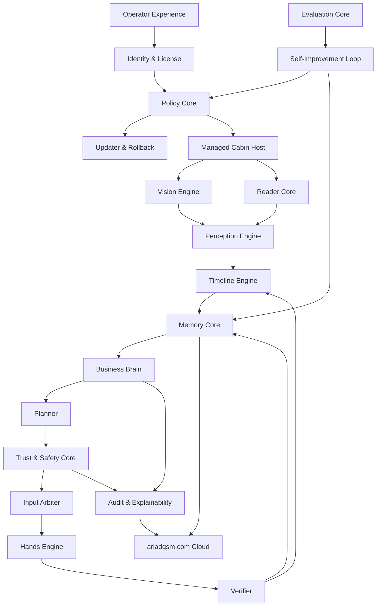

# AriadGSM Final Product Blueprint

Fecha: 2026-04-27
Estado: redisenio maestro de producto
Objetivo: dejar de construir parches y alinear todo hacia una IA operativa que trabaje como Bryams

## 1. Decision central

AriadGSM no se va a disenar como un bot que ejecuta reglas.

AriadGSM se va a disenar como una IA operativa local con cuerpo, memoria, juicio, permisos, auditoria y aprendizaje.

La experiencia final debe ser:

```text
Abro AriadGSM -> inicio sesion -> la IA se presenta -> alista la cabina -> verifica los 3 WhatsApps -> empieza a observar -> aprende -> prioriza -> razona -> propone o actua segun permiso -> verifica -> registra -> reporta -> mejora.
```

La IA debe parecerse a Bryams en el sentido correcto:

- entiende clientes, paises, jergas y urgencias;
- recuerda precios, deudas, pagos, servicios, proveedores y errores;
- sabe cuando falta informacion;
- no promete sin base;
- negocia con criterio;
- cuida margen y reputacion;
- no pelea contra el operador;
- aprende de correcciones;
- explica lo que hace.

No debe parecerse a Bryams en lo riesgoso:

- no actua a ciegas;
- no envia mensajes sensibles sin permiso inicial;
- no mueve mouse si el humano esta usando la PC;
- no guarda basura como conocimiento;
- no acepta instrucciones de clientes como si fueran ordenes internas;
- no toca contabilidad final sin evidencia.

## 2. Fuentes externas usadas

Este plano se apoya en referencias de agentes, seguridad, dominios y experiencia humano-IA.

### 2.1 OpenAI: agentes, herramientas, guardrails y evaluaciones

OpenAI recomienda disenar agentes con modelo, herramientas, instrucciones, guardrails, aprobaciones humanas cuando hay riesgo y evaluaciones para medir comportamiento.

Impacto en AriadGSM:

- el Business Brain razona;
- las herramientas son capacidades invocables;
- Trust & Safety autoriza acciones;
- cada autonomia se evalua antes de subir de nivel.

Referencias:

- https://openai.com/business/guides-and-resources/a-practical-guide-to-building-ai-agents/
- https://platform.openai.com/docs/guides/agent-builder-safety
- https://platform.openai.com/docs/guides/agent-evals

### 2.2 NIST AI RMF: gobernar, mapear, medir y gestionar riesgo

NIST AI RMF recomienda gestionar riesgos de IA durante diseno, desarrollo, uso y evaluacion.

Impacto en AriadGSM:

- cada capacidad autonoma debe tener riesgo conocido;
- la app debe medir fallos, confianza y acciones bloqueadas;
- el sistema debe poder explicar y auditar decisiones.

Referencia:

- https://www.nist.gov/publications/artificial-intelligence-risk-management-framework-generative-artificial-intelligence

### 2.3 OWASP LLM Top 10: exceso de agencia, memoria contaminada y mal uso de herramientas

OWASP identifica riesgos como prompt injection, data poisoning, excessive agency, overreliance y fuga de datos.

Impacto en AriadGSM:

- un cliente no puede ordenar a la IA que ignore sus reglas;
- la memoria no acepta cualquier texto como verdad;
- mover mouse, escribir, enviar y registrar pagos son herramientas con permisos;
- se bloquean acciones con baja confianza.

Referencia:

- https://owasp.org/www-project-top-10-for-large-language-model-applications/

### 2.4 Microsoft: UI Automation y Human-AI Interaction

Microsoft UI Automation permite leer interfaces con estructura, mejor que depender solo de OCR. Microsoft Human-AI Interaction recomienda mantener al usuario en control, comunicar incertidumbre, corregir errores y aprender con el tiempo.

Impacto en AriadGSM:

- Reader Core debe preferir DOM/accesibilidad/UI Automation antes que OCR;
- el operador debe entender que esta haciendo la IA;
- cuando la IA falla, debe reportar causa y permitir recuperacion.

Referencias:

- https://learn.microsoft.com/en-us/windows/win32/winauto/ui-automation-specification
- https://www.microsoft.com/en-us/research/?p=677448

### 2.5 Microsoft DDD y arquitectura por dominios

Microsoft recomienda separar sistemas complejos por dominios, lenguaje comun y responsabilidades claras.

Impacto en AriadGSM:

- contabilidad, precios, clientes, servicios, mercado, procedimientos y seguridad son dominios mentales;
- no se deben mezclar decisiones de negocio con coordenadas de pantalla;
- WhatsApp es canal, no el negocio completo.

Referencias:

- https://learn.microsoft.com/en-us/dotnet/architecture/microservices/microservice-ddd-cqrs-patterns/ddd-oriented-microservice
- https://learn.microsoft.com/en-us/azure/architecture/microservices/model/domain-analysis

### 2.6 Chrome DevTools Protocol y navegadores

Chrome DevTools Protocol expone DOM, accesibilidad, eventos, red y runtime para navegadores Chromium.

Impacto en AriadGSM:

- Chrome y Edge pueden tener lectura estructurada cuando se usen perfiles controlados;
- CDP debe tratarse como capacidad sensible, no como acceso ilimitado;
- Firefox necesita adaptador equivalente por accesibilidad, WebDriver BiDi o UI Automation.

Referencia:

- https://chromedevtools.github.io/devtools-protocol/

## 3. Anti-meta: lo que queda prohibido

Para evitar repetir el ciclo de parches, quedan prohibidos estos patrones:

1. Un modulo distinto al Cabin Manager no puede abrir, cerrar, mover o adoptar navegadores.
2. Hands Engine no puede decidir por negocio; solo ejecuta acciones autorizadas.
3. Vision/OCR no puede crear conocimiento final sin verificacion.
4. Cognitive Core no puede ejecutar herramientas directo; pasa por Trust & Safety.
5. Un texto de cliente no puede cambiar politicas internas.
6. La app no puede empezar acciones al abrirse antes de login y autorizacion.
7. El updater no puede reemplazar binarios sin version, hash, rollback y estado visible.
8. La memoria no puede mezclar hechos confirmados con sospechas.
9. La interfaz no debe mostrar tablas tecnicas como pantalla principal del operador.
10. No se agregan filtros infinitos para tapar errores de identidad; se corrige la fuente.

## 4. Producto final

Nombre de producto:

```text
AriadGSM IA Local
```

Nombre interno de plataforma:

```text
AriadGSM Autonomous Operating System
```

Promesa:

```text
Una IA local que observa tus 3 WhatsApps, entiende tu negocio GSM, aprende de clientes y operaciones, organiza contabilidad y ejecuta acciones en la PC bajo niveles seguros de autonomia.
```

La IA debe trabajar en cinco planos:

1. Cabina: preparar entorno, navegadores, ventanas, login, versiones.
2. Ojos: ver solo lo permitido y convertir pantalla en objetos reales.
3. Cerebro: razonar sobre negocio, clientes, precios, tecnicos, mercado y riesgo.
4. Memoria: guardar experiencia util, no ruido.
5. Manos: actuar en la PC solo con permiso, verificacion y auditoria.

## 5. Arquitectura final por capas



## 6. Operator Experience

La interfaz no debe ser una consola tecnica.

Debe ser un panel social, claro y cercano:

```text
Hola Bryams. Estoy lista.
Estado de cabina: 2 de 3 WhatsApps listos.
Estoy revisando Chrome porque falta WhatsApp 2.
No voy a mover el mouse mientras lo estes usando.
Aprendi 12 mensajes nuevos y detecte 2 posibles pagos para revisar.
```

Pantallas principales:

1. Login.
2. Inicio de IA.
3. Alistar cabina.
4. Actividad viva.
5. Aprendizaje.
6. Contabilidad.
7. Correcciones de Bryams.
8. Historial/auditoria.
9. Configuracion avanzada.

La pantalla inicial despues de login debe tener solo tres decisiones humanas:

```text
Alistar cabina
Encender IA
Revisar aprendizajes
```

Las tablas tecnicas pasan a soporte, no a primera vista.

## 7. Identity & License

Responsabilidades:

- login del operador;
- licencia;
- rol;
- permisos;
- version activa;
- canal de update;
- modo seguro.

Regla:

La IA no alista cabina, no lee WhatsApp y no mueve mouse antes de tener una sesion autorizada.

## 8. Policy Core

Es el contrato vivo de que puede hacer la IA.

Permisos separados:

```text
canReadWhatsApp
canLearnFromChats
canOpenChats
canMoveMouse
canTypeDrafts
canSendMessages
canCreateAccountingDrafts
canConfirmAccountingRecords
canUseExternalTools
canUpdateItself
```

Cada permiso tiene:

- nivel de autonomia minimo;
- riesgo;
- si requiere confirmacion;
- si se permite en segundo plano;
- si puede ejecutarse con humano usando mouse;
- si exige verificacion posterior.

## 9. Managed Cabin Host

El problema de cerrar Edge/Chrome/Firefox se resuelve aqui, no en Hands ni Perception.

El Cabin Host es el unico dueno de navegadores.

Asignacion actual:

```text
wa-1 = Edge
wa-2 = Chrome
wa-3 = Firefox
```

Contrato por canal:

```json
{
  "channelId": "wa-1",
  "browser": "edge",
  "expectedUrl": "https://web.whatsapp.com",
  "processId": 0,
  "windowHandle": "0x00000000",
  "profile": "AriadGSM-wa-1",
  "boxId": "box-1",
  "state": "READY",
  "confidence": 0.98,
  "lastVerifiedAt": "2026-04-27T00:00:00Z",
  "reason": "Visible WhatsApp Web in assigned box"
}
```

Estados permitidos:

```text
READY
MISSING
STARTING
WRONG_BROWSER
WRONG_PAGE
NEEDS_QR
ALREADY_OPEN_ELSEWHERE
COVERED
MINIMIZED
OFFSCREEN
OPERATOR_USING
RECOVERING
FAILED_NEEDS_HUMAN
```

Reglas:

1. Si existe una ventana valida, se adopta; no se abre otra.
2. Si esta tapada, se trae al frente; no se cierra.
3. Si esta en otra pagina, se navega solo dentro del navegador asignado.
4. Si WhatsApp dice "usar aqui", se pide permiso o se registra accion de bajo riesgo segun politica.
5. Si el perfil esta corrupto, se marca `FAILED_NEEDS_HUMAN`; no se destruye perfil.
6. El estado de cada canal es fuente de verdad para todos los modulos.

## 10. Box Grid

Las tres ventanas viven en cajas:

```text
box-1 izquierda  -> wa-1 Edge
box-2 centro     -> wa-2 Chrome
box-3 derecha    -> wa-3 Firefox
```

La caja no es cosmetica. Es una frontera de seguridad.

Reglas:

- Vision solo entrega evidencia dentro de cajas autorizadas.
- Perception etiqueta todo por caja y canal.
- Hands solo puede clicar dentro de la caja autorizada.
- Si una ventana sale de su caja, la cabina queda degradada.
- Si algo tapa la caja, no se aprende; se reporta.

## 11. Vision Engine

Responsabilidad:

- detectar ventanas;
- capturar evidencia visual temporal;
- detectar cambios;
- guardar buffer local corto;
- no decidir negocio.

Vision no debe decir "cliente quiere precio".

Vision solo dice:

```text
En box-2 cambio la region del listado de chats.
En box-1 hay una ventana visible con titulo WhatsApp.
En box-3 aparecio modal.
```

## 12. Reader Core

Orden de lectura:

```text
1. DOM / Browser Bridge cuando sea seguro
2. Windows UI Automation
3. Accessibility tree
4. OCR por region
5. Vision model verifier
```

OCR es respaldo, no verdad absoluta.

El Reader Core produce objetos:

```json
{
  "channelId": "wa-2",
  "conversationId": "customer-omar-torres-colombia",
  "chatTitle": "Omar Torres Colombia",
  "messageId": "msg-...",
  "direction": "incoming",
  "sender": "Omar Torres",
  "text": "bro cuanto sale frp motorola",
  "timestamp": "2026-04-27T18:10:00-05:00",
  "source": "ui_automation",
  "confidence": 0.94
}
```

No produce lineas sueltas como:

```text
Buscar
Foto
5:00 p. m.
Pagos Mexico
```

## 13. Perception Engine

Convierte lectura en objetos del trabajo:

- chat visible;
- cliente;
- proveedor;
- grupo;
- mensaje;
- pregunta;
- pago;
- deuda;
- oferta;
- servicio;
- urgencia;
- pais;
- moneda;
- evidencia;
- fila clicable;
- conversacion abierta.

Perception no responde clientes. Solo entiende la escena.

## 14. Timeline Engine

Une modo vivo y aprendizaje.

Ya no deben existir dos mundos separados.

Cada conversacion tiene una historia:

```text
historial aprendido + mensajes vivos + acciones de IA + correcciones humanas + pagos + resultados
```

El limite de aprendizaje historico inicial sigue siendo 1 mes, pero la memoria final conserva eventos resumidos y evidencias utiles.

## 15. Memory Core

La memoria se divide como una mente real:

### 15.1 Memoria episodica

Que paso, cuando, con quien, por que canal y con que resultado.

Ejemplo:

```text
El 27/04 Omar pidio FRP Motorola, se cotizo, no pago, volvio a preguntar.
```

### 15.2 Memoria semantica

Hechos estables del negocio.

Ejemplo:

```text
Omar Torres suele pedir servicios Colombia.
Motorola FRP requiere confirmar modelo antes de precio final.
Pagos Mexico es grupo de bajo aprendizaje.
```

### 15.3 Memoria procedimental

Como hacer tareas.

Ejemplo:

```text
Para Xiaomi con USB Redirector caido: verificar conexion, revisar proveedor alterno, pedir captura del error, no prometer entrega.
```

### 15.4 Memoria contable

Pagos, deudas, reembolsos, comprobantes, monedas, metodo, cliente y caso.

Regla:

La IA puede crear borradores contables. Cierre final requiere evidencia o autorizacion segun nivel.

### 15.5 Memoria de preferencias de Bryams

Estilo de respuesta, tono, margenes, proveedores favoritos, paises, prioridades y excepciones.

## 16. Business Brain

Este es el nucleo de IA.

No es una lista de reglas. Es un gerente mental que coordina dominios.

Dominios mentales:

1. Customer Mind: entiende clientes, historial, confianza y estilo.
2. Conversation Mind: interpreta idioma, jerga, intencion y tono.
3. Service Mind: entiende marca, modelo, bloqueo, herramienta y dificultad.
4. Pricing Mind: razona precio, margen, costo, moneda, pais y demanda.
5. Market Mind: aprende ofertas, proveedores, disponibilidad y cambios.
6. Accounting Mind: detecta pago, deuda, reembolso, credito y evidencia.
7. Procedure Mind: aprende procesos, errores, pasos y alternativas.
8. Case Mind: organiza trabajos abiertos, estado y prioridad.
9. Risk Mind: calcula riesgo tecnico, comercial, reputacional y contable.
10. Human Collaboration Mind: sabe cuando preguntar a Bryams.
11. Learning Mind: decide que se convierte en conocimiento y que queda en duda.
12. Tool Mind: decide que herramienta puede resolver el trabajo.

El Brain no mueve mouse. Decide objetivos:

```text
Necesito abrir el chat de Omar en wa-2 para leer contexto.
Necesito pedir modelo exacto antes de cotizar.
Necesito crear borrador de pago, pero falta evidencia.
Necesito pausar porque Bryams tomo el mouse.
```

## 17. Trust & Safety Core

Esta es la pieza que faltaba.

Es obligatorio entre Brain y Hands.

Revisa:

- permiso activo;
- nivel de autonomia;
- riesgo;
- ventana correcta;
- caja correcta;
- fuente de lectura;
- confianza;
- si el humano esta usando input;
- si la accion es reversible;
- si necesita confirmacion.

Salida:

```text
ALLOW
ALLOW_WITH_LIMIT
ASK_HUMAN
PAUSE_FOR_OPERATOR
BLOCK
```

Ejemplo:

```json
{
  "decision": "ASK_HUMAN",
  "reason": "La IA quiere enviar un mensaje con precio final, pero el servicio tiene baja confianza y no hay modelo exacto.",
  "requiredApproval": "send_message"
}
```

## 18. Input Arbiter

Es el semaforo entre Bryams y la IA.

Reglas:

1. Si Bryams mueve mouse o teclado, la IA suelta control.
2. La IA mantiene estado y explica que pauso.
3. Cuando el operador deja de usar input por un tiempo seguro, la IA puede retomar.
4. Si una accion estaba a medias, verifica antes de continuar.
5. No se apaga todo; se transfiere control.

Estados:

```text
AI_CONTROL
HUMAN_CONTROL
WAITING_SAFE_RESUME
VERIFYING_AFTER_HANDOFF
PAUSED_NEEDS_HUMAN
```

## 19. Hands Engine

Hands no piensa negocio.

Ejecuta acciones autorizadas:

- enfocar ventana;
- abrir chat;
- hacer scroll;
- copiar texto visible si esta permitido;
- escribir borrador;
- no enviar sin permiso;
- tomar evidencia;
- operar herramienta registrada.

Cada accion debe tener verificacion:

```text
Quise abrir chat Omar -> verifique que titulo abierto es Omar -> lei 43 mensajes -> OK.
```

Si falla:

```text
No abri chat Omar porque la fila estaba tapada por modal de perfil.
```

## 20. Tool Registry

Para que sea IA y no bot, las herramientas no se queman en codigo.

Cada herramienta se registra con capacidades:

```json
{
  "toolId": "usb-redirector",
  "name": "USB Redirector",
  "capabilities": ["remote_usb", "device_forwarding"],
  "risk": "medium",
  "inputsNeeded": ["client_pc", "device_connected"],
  "failureSignals": ["connection_lost", "license_error"],
  "alternatives": ["anydesk_usb", "provider_remote_session"],
  "requiresHumanApproval": true
}
```

El Brain decide por capacidad:

```text
Necesito remote_usb estable.
USB Redirector fallo.
Busco alternativa con remote_usb.
```

No decide por parche:

```text
Si USB Redirector falla, abrir programa X.
```

## 21. Accounting Core

La contabilidad no debe ser un efecto secundario de leer palabras.

Flujo:

```text
evidencia -> borrador -> validacion -> conciliacion -> registro final -> reporte
```

La IA puede detectar:

- pago prometido;
- comprobante enviado;
- monto;
- moneda;
- metodo;
- deuda;
- reembolso;
- credito;
- servicio asociado;
- cliente asociado;
- duda o conflicto.

Estados:

```text
DRAFT
NEEDS_EVIDENCE
NEEDS_HUMAN_REVIEW
CONFIRMED
RECONCILED
REJECTED
```

## 22. Evaluation Core

No se sube autonomia por fe.

Cada capacidad se evalua:

- detectar WhatsApp correcto;
- no cerrar navegador;
- abrir chat correcto;
- leer mensajes utiles;
- ignorar grupos de bajo valor;
- ceder mouse;
- no enviar mensajes sin permiso;
- detectar pago con evidencia;
- registrar aprendizaje correcto;
- explicar fallos.

Metricas:

```text
window_identity_accuracy
chat_open_success_rate
message_extraction_precision
human_takeover_latency_ms
blocked_unsafe_actions
false_learning_rate
accounting_draft_accuracy
operator_corrections
```

## 23. Self-Improvement Loop

La IA no se automejora modificando codigo sola.

Se automejora asi:

1. Detecta error.
2. Guarda evento.
3. Explica causa probable.
4. Pide o recibe correccion de Bryams.
5. Actualiza memoria/politica/procedimiento.
6. Crea evaluacion para no repetir.
7. Si requiere codigo, queda como propuesta para actualizacion versionada.

Esto evita que una memoria mala rompa el sistema.

## 24. Autonomia por niveles

```text
Nivel 0: Apagada
Nivel 1: Observa
Nivel 2: Aprende
Nivel 3: Recomienda
Nivel 4: Navega y lee con permiso
Nivel 5: Escribe borradores
Nivel 6: Ejecuta acciones reversibles
Nivel 7: Ejecuta acciones sensibles con confirmacion
Nivel 8: Autonomia operacional limitada por politicas
```

Primer objetivo realista:

```text
Nivel 4 estable: alista cabina, lee 3 WhatsApps, abre chats, aprende, registra borradores y reporta sin cerrar ventanas ni pelear mouse.
```

Nivel final:

```text
Nivel 8: opera partes repetibles del negocio, con auditoria y confirmacion en acciones sensibles.
```

## 25. Estados del producto

### 25.1 Estado actual

Hay piezas:

- Windows app;
- login;
- updater;
- version;
- Vision;
- Perception;
- Timeline;
- Memory;
- Cognitive;
- Operating;
- Hands;
- Supervisor;
- eventos;
- nube.

Problema:

Las piezas aun no obedecen una autoridad de producto final. Por eso aparecen parches, cierres de ventanas, reportes tecnicos y confusion de interfaz.

### 25.2 Estado objetivo v1

Producto estable:

- login visible;
- alistar cabina confiable;
- no cierra ventanas;
- no pelea mouse;
- lee 3 WhatsApps;
- aprende mensajes utiles;
- registra memoria y borradores contables;
- muestra actividad entendible;
- no envia nada sin permiso.

### 25.3 Estado objetivo v2

IA operadora:

- prioriza clientes;
- propone respuestas;
- cotiza con memoria;
- detecta pagos/deudas;
- aprende procedimientos;
- usa herramientas con permiso;
- verifica resultados;
- mejora con correcciones.

### 25.4 Estado objetivo v3

IA tipo Bryams:

- opera parte del negocio con criterio;
- entiende excepciones;
- coordina herramientas;
- negocia;
- aprende mercado;
- gestiona contabilidad;
- pide ayuda solo cuando corresponde;
- reporta decisiones como un asistente real.

## 26. Roadmap de reconstruccion

No se reconstruye todo de golpe en codigo. Se reconstruye por contratos de producto, pero cada bloque debe quedar cerrado antes de pasar.

### Bloque A: Product Shell

Objetivo:

- interfaz final;
- login;
- estado humano;
- version;
- updater con rollback;
- boton Alistar;
- boton Encender;
- actividad viva.

Exito:

El usuario entiende que pasa sin leer logs tecnicos.

### Bloque B: Cabin Authority

Objetivo:

- Cabin Manager unico;
- Edge/Chrome/Firefox asignados;
- adopcion de ventanas;
- box grid;
- no cerrar navegadores;
- progreso 0-100 real.

Exito:

Alistar WhatsApps deja 3 canales listos o explica exactamente que falta.

### Bloque C: Safe Eyes

Objetivo:

- Reader Core multi-fuente;
- objetos de mensaje;
- canal correcto;
- grupos de bajo aprendizaje;
- evidencia y confianza.

Exito:

La IA lee mensajes utiles, no interfaz.

### Bloque D: Living Memory

Objetivo:

- memoria episodica;
- memoria semantica;
- memoria procedimental;
- memoria contable;
- separacion hecho/sospecha;
- correcciones humanas.

Exito:

Bryams puede ver que aprendio y corregirlo.

### Bloque E: Business Brain

Objetivo:

- dominios mentales;
- razonamiento por casos;
- precios;
- mercado;
- contabilidad;
- procedimiento;
- riesgo.

Exito:

La IA no solo detecta palabras; entiende que hacer y que falta.

### Bloque F: Trust & Safety

Objetivo:

- permisos;
- niveles;
- aprobaciones;
- bloqueo por riesgo;
- audit log;
- seguridad ante prompt injection.

Exito:

La IA tiene poder, pero no poder ciego.

### Bloque G: Hands & Verification

Objetivo:

- abrir chats;
- scroll;
- leer historial;
- escribir borrador;
- no enviar sin permiso;
- verificar cada accion.

Exito:

La IA actua en WhatsApp sin cerrar ventanas ni pelear con el operador.

### Bloque H: Cloud Intelligence

Objetivo:

- sincronizar entendimiento, no video crudo;
- panel ariadgsm.com;
- reportes;
- respaldos;
- aprendizaje y contabilidad.

Exito:

La nube muestra negocio entendido, no logs inutiles.

### Bloque I: Evaluation & Release

Objetivo:

- pruebas por capacidad;
- versionado;
- rollback;
- diagnostico;
- release notes;
- subida GitHub.

Exito:

Cada version dice que mejora, que valida y que no se pudo validar.

## 27. Primer corte obligatorio

Antes de tocar mas autonomia, el siguiente corte debe ser:

```text
AriadGSM 0.8.x Product Reset
```

Incluye:

1. Product Shell simplificado.
2. Cabin Authority como unica fuente de verdad.
3. Trust & Safety Core minimo.
4. Input Arbiter real.
5. Logs humanos separados de logs tecnicos.
6. Progreso de Alistar WhatsApps real.
7. Prohibicion de cerrar Edge/Chrome/Firefox fuera de Cabin Manager.
8. Memoria clasificada como hecho, sospecha o aprendizaje pendiente.
9. Evaluaciones para no repetir el fallo de cerrar ventanas.

## 28. Definicion de "IA como Bryams"

No significa copiar una personalidad superficial.

Significa modelar capacidades:

```text
Ver contexto -> entender intencion -> recordar historial -> evaluar riesgo -> cuidar negocio -> decidir siguiente mejor accion -> actuar con permiso -> verificar -> aprender.
```

La IA debe formar criterio AriadGSM:

- que clientes son frecuentes;
- que paises pagan como;
- que servicios tienen riesgo;
- que proveedor conviene;
- que precio protege margen;
- que mensaje suena natural;
- que casos requieren humano;
- que errores ya pasaron;
- que herramienta sirve para cada capacidad;
- que informacion falta antes de avanzar.

## 29. Frase guia para todo el desarrollo

```text
No construimos un bot para WhatsApp.
Construimos una IA operadora local para AriadGSM, con WhatsApp como una de sus ventanas de trabajo.
```

## 30. Control de continuidad

El orden operativo vigente vive en:

```text
docs/ARIADGSM_EXECUTION_LOCK.md
```

Ese archivo manda sobre el roadmap cuando Bryams pida avanzar por bloques. Su
proposito es impedir que el desarrollo vuelva a saltar entre ideas, parches o
prioridades cambiantes.
